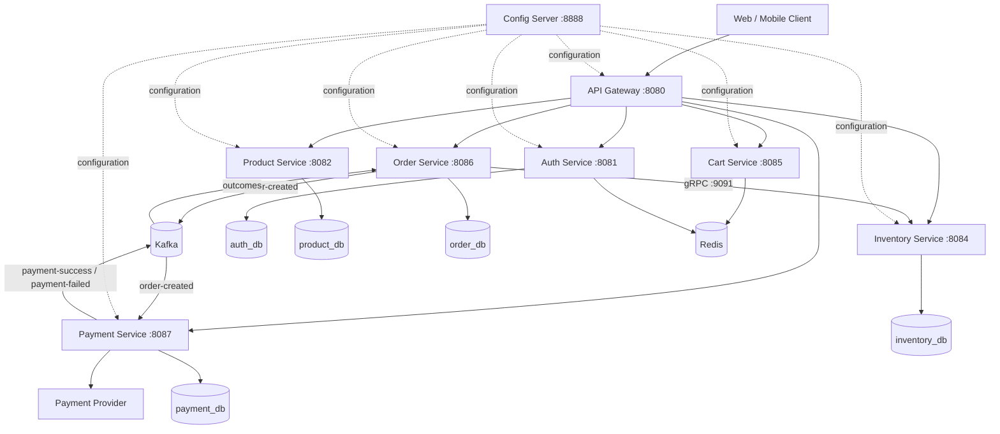
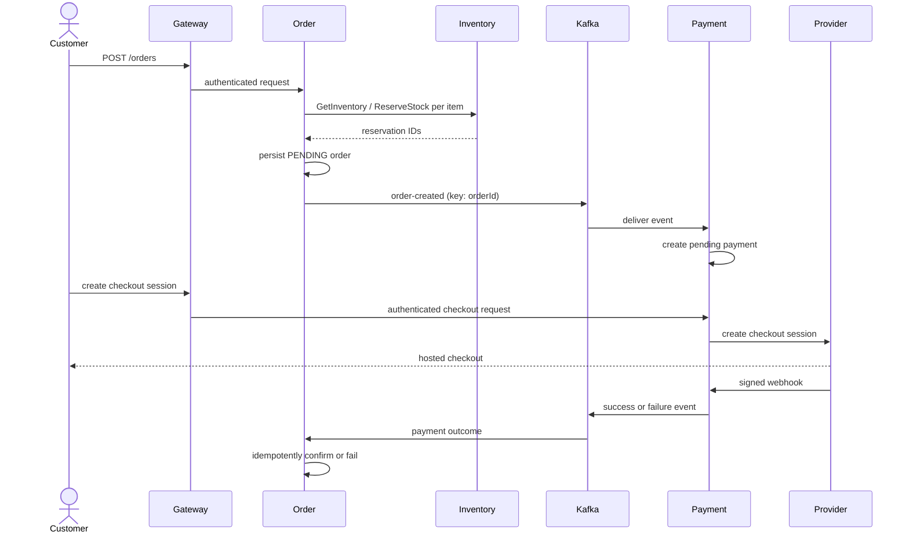
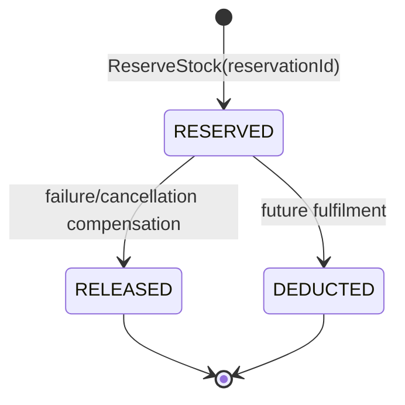
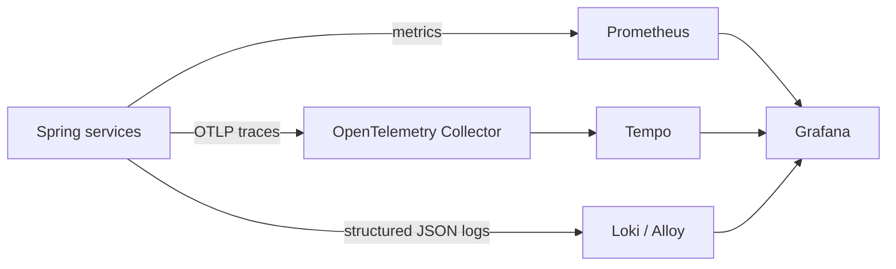

# High-Level Design — E-Commerce Platform

**Status:** Current architecture baseline with planned target extensions  
**Version:** 1.0  
**Updated:** 12 August 2026

## 1. Objective

Provide a secure, observable, cloud-ready e-commerce backend that keeps domain
ownership independent while coordinating ordering, inventory, and payments
reliably. This design uses local consistency per service plus idempotent,
recoverable cross-service workflows rather than distributed transactions.

## 2. Architectural style

- Java 21 / Spring Boot domain-aligned microservices.
- REST/JSON for client-to-platform communication through API Gateway.
- gRPC/Protocol Buffers for synchronous internal inventory operations.
- Kafka for asynchronous domain workflows.
- PostgreSQL for transactional data and Redis for cart/token-blacklist state.
- Config Server for environment settings and Prometheus/Grafana/Tempo/Loki for observability.

## 3. Context and container view

## 4. Service responsibilities

| Service | Data owned | Responsibility |
| --- | --- | --- |
| Gateway | None | External entry point, JWT validation, CORS, routing, diagnostics. |
| Config Server | Git checkout/cache | Environment configuration service. |
| Auth | PostgreSQL users/refresh tokens; Redis blacklist | Identity, JWT lifecycle, profile, and user administration. |
| Product | PostgreSQL catalog | Public catalog and administrator mutations. |
| Cart | Redis cart records | Temporary customer cart. |
| Inventory | PostgreSQL inventory/reservations | Stock administration and idempotent reservation lifecycle. |
| Order | PostgreSQL orders, inbox, release outbox | Order lifecycle and inventory compensation. |
| Payment | PostgreSQL payments, attempts, refunds, webhooks | Checkout, provider webhooks, refunds, and outcomes. |

Clients use REST through Gateway. Order calls Inventory through gRPC; Kafka
carries `order-created`, `payment-success`, and `payment-failed`. Each service
owns its data; no cross-service database foreign keys are used.

## 5. Security model

1. Auth Service issues JWT access and refresh tokens.
2. Gateway and resource services validate issuer, signature, expiry, and role
   using OAuth2 Resource Server support and Auth JWK material.
3. JWT `userId` establishes ownership; `role` maps to `ROLE_CUSTOMER` or
   `ROLE_ADMIN`.
4. Registration/login/refresh and catalog reads are public. Admin paths require
   `ADMIN`; remaining business paths require authentication.
5. Credentials, provider keys, and environment configuration stay outside source control.

## 6. Key workflows

### 6.1 Checkout and payment outcome saga

On failure/cancellation, Order Service saves inventory-release commands in the
same local transaction as the status change and retries `ReleaseStock` until
acknowledged. On payment success, inventory remains reserved until future
fulfilment deducts it.

### 6.2 Inventory state model

### 6.3 Observability flow

## 7. Reliability strategy

| Risk | Current control |
| --- | --- |
| Duplicate payment outcomes | Order inbox keyed by event ID. |
| Concurrent outcomes | Pessimistic order lock. |
| Duplicate provider webhook | Provider/event uniqueness in Payment Service. |
| Inventory outage on compensation | Durable release outbox and idempotent reservation-aware gRPC release. |
| Failed outcome processing | Three retries, then `order-dlq`. |
| Concurrent inventory updates | Local inventory-row lock and reservation ledger. |

No distributed transaction spans PostgreSQL, Kafka, gRPC, and provider APIs.

## 8. Deployment view

Docker Compose provides local PostgreSQL (5433), Redis (6379), Kafka (29092
host/9092 internal), and the observability stack. Services use externalized
profile settings through Config Server. The target deployment is Kubernetes
with managed data/messaging services, secrets, probes, autoscaling, and
environment observability.

## 9. Target extensions

The target adds Notification, Shipping/Fulfilment, Address, Pricing, Search,
Review, and optional AI services. Platform hardening adds transactional
outboxes, persistent JWK management, gRPC resilience, Testcontainers and
contract tests, CI/CD gates, Kubernetes, and chaos/recovery testing.

See [requirements specification](requirements-specification.md) for the
prioritized acceptance conditions.
