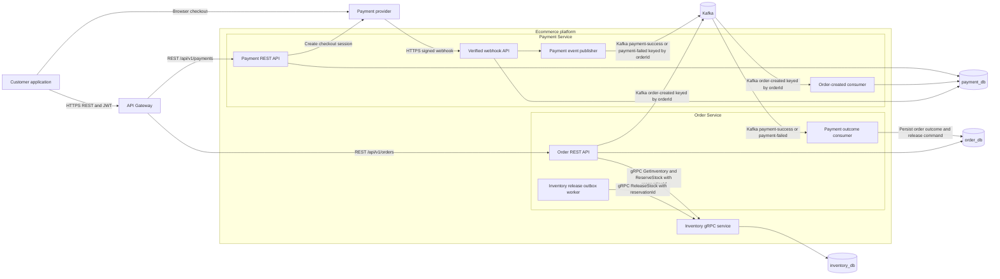
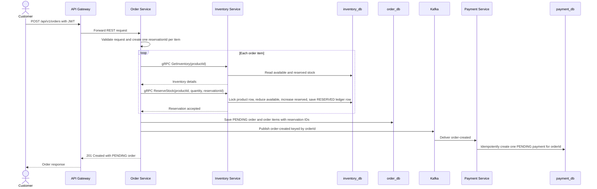
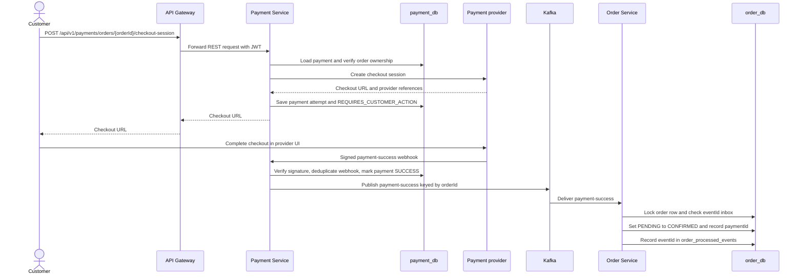
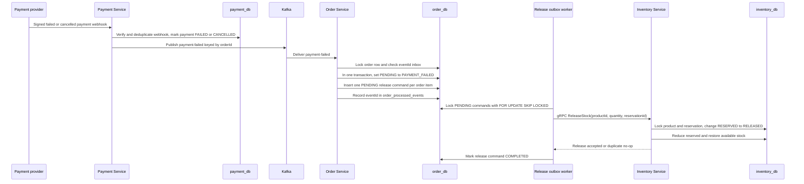
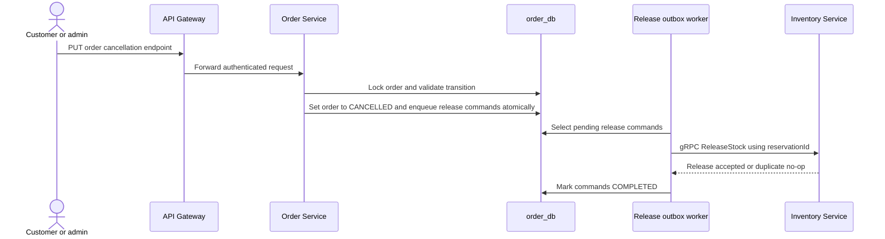
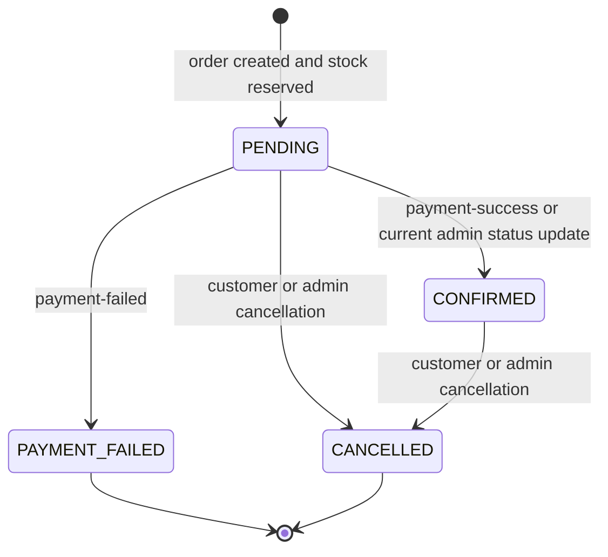
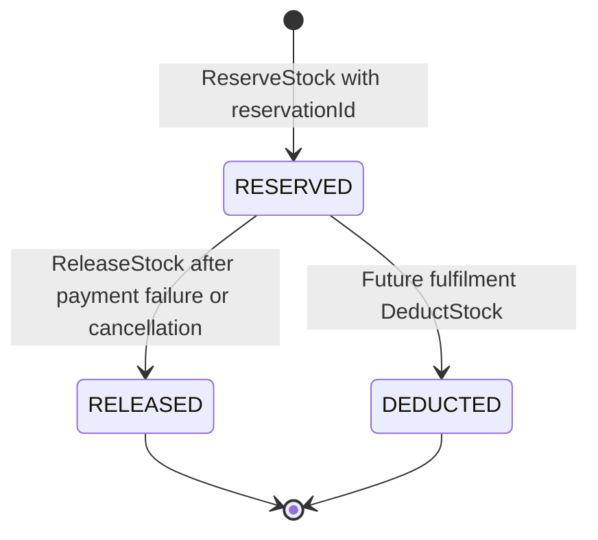
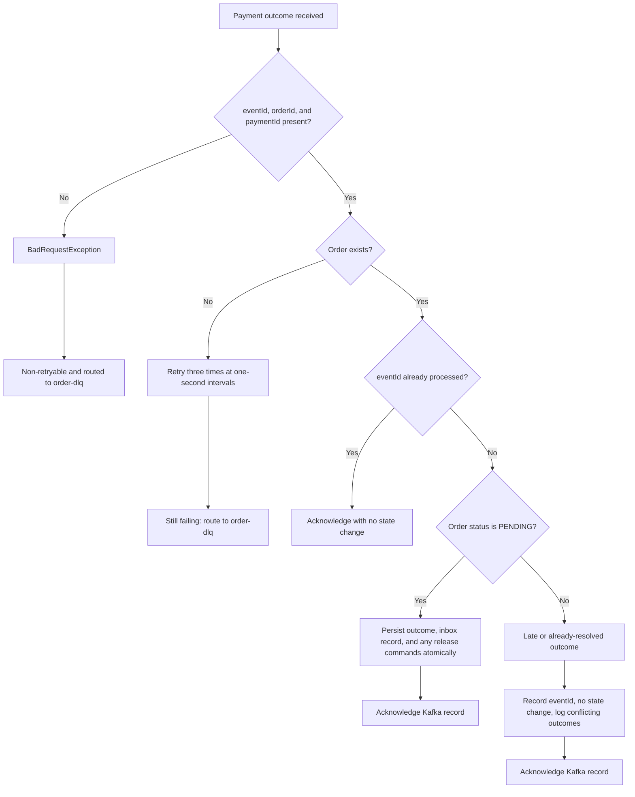
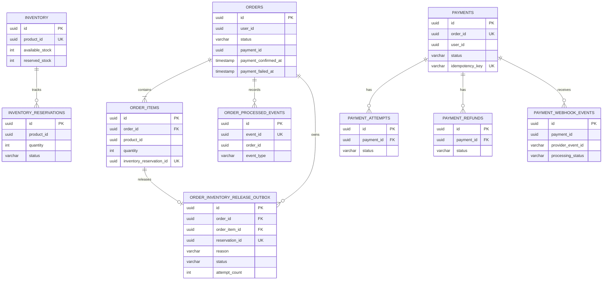

# Order, Payment, and Inventory Saga Design

> **Status:** Current implementation design
>
> This document describes the order-to-payment lifecycle implemented in this
> repository. Mermaid diagrams render automatically when this file is viewed on
> GitHub.

## 1. Purpose and scope

The flow reserves inventory while an order awaits payment, confirms the order
when the payment provider reports success, and safely releases the reservation
when payment fails or the order is cancelled.

The main guarantees are:

- A payment success changes an order from `PENDING` to `CONFIRMED`.
- A payment failure changes a `PENDING` order to `PAYMENT_FAILED` and creates a
  durable inventory-release command in the same Order database transaction.
- A release is idempotent: retrying the same reservation does not add stock
  twice.
- Payment outcome consumption is idempotent: Kafka can redeliver an event
  without changing the order more than once.
- Every payment outcome is keyed by `orderId`, preserving Kafka partition order
  for a single order.

`CONFIRMED` means that payment has been verified. It does **not** deduct stock.
Stock remains reserved until a future fulfilment or shipment service calls the
reservation-aware `DeductStock` operation.

### In scope

- Order creation, inventory reservation, and `order-created` publication.
- Payment preparation, checkout, verified payment-provider webhooks, and
  payment outcome events.
- Order confirmation, payment failure, cancellation, inventory compensation,
  retries, and dead-letter handling.
- Dev and stage rollout, smoke testing, and operational monitoring.

### Out of scope

- Shipment, delivery, and the eventual `DeductStock` call.
- Automatic refund orchestration after a confirmed order is cancelled.
- Transactional outboxes for `order-created` and payment outcome publication.
  Those are documented as follow-up work in [Known limitations and next
  work](#11-known-limitations-and-next-work).

## 2. System context

### 2.1 Architecture and protocols



The API Gateway is the normal public entry point when its routes are supplied
by the external configuration repository. Order Service calls Inventory Service
directly over gRPC; business events flow over Kafka. The payment provider calls
Payment Service directly through its signed webhook endpoint.

### 2.2 Component responsibilities

| Component | Responsibility in this flow | Storage it owns |
| --- | --- | --- |
| API Gateway | Routes authenticated customer REST requests to Order and Payment Services. | None |
| Order Service | Creates orders, reserves stock, consumes payment outcomes, and owns compensation commands. | `order_db` |
| Inventory Service | Holds available and reserved quantities and the durable reservation ledger. | `inventory_db` |
| Payment Service | Prepares one payment per order, creates provider checkout sessions, verifies webhooks, and publishes outcomes. | `payment_db` |
| Kafka | Delivers `order-created`, `payment-success`, and `payment-failed` events. | Kafka topics |
| Payment provider | Hosts checkout and reports the authoritative payment outcome by signed webhook. | Provider-managed |

Auth Service issues the JWT before the purchase flow. Product Service and Cart
Service are not called directly during the current Order-to-Payment critical
path; the order request already contains the selected items and prices.

## 3. Integration contracts

### 3.1 Synchronous calls

| Step | Caller -> receiver | Protocol | Operation / endpoint | Important data |
| --- | --- | --- | --- | --- |
| Create order | Customer -> Gateway -> Order Service | HTTPS REST | `POST /api/v1/orders` | Bearer JWT, items, shipping address, currency |
| Check availability | Order Service -> Inventory Service | gRPC | `GetInventory(productId)` | `productId` |
| Reserve stock | Order Service -> Inventory Service | gRPC | `ReserveStock(productId, quantity, reservationId)` | Stable UUID per order item |
| Start checkout | Customer -> Gateway -> Payment Service | HTTPS REST | `POST /api/v1/payments/orders/{orderId}/checkout-session` | JWT ownership check |
| Provider checkout | Payment Service / Customer -> Provider | Provider HTTPS API and browser redirect | Create and complete checkout session | Payment, order, user, amount, currency |
| Provider outcome | Provider -> Payment Service | HTTPS REST webhook | `/api/v1/payments/webhooks/stripe` or `/api/v1/payments/webhooks/razorpay` | Raw payload plus provider signature |
| Release stock | Order release worker -> Inventory Service | gRPC | `ReleaseStock(productId, quantity, reservationId)` | Same stable reservation UUID |
| Future fulfilment | Fulfilment Service -> Inventory Service | gRPC | `DeductStock(productId, quantity, reservationId)` | Not implemented by this flow yet |

The gRPC contract retains quantity-only operations only for rolling deployment
compatibility. New Order Service code always supplies `reservationId`; this is
required for safe retries.

Stripe is the implemented checkout and webhook provider. The Razorpay endpoint
and adapter shape exist, but its checkout and webhook implementation currently
returns an unsupported-operation error; do not use it for a dev or stage smoke
test until that adapter is completed.

### 3.2 Kafka topics

| Topic | Producer | Consumer group | Consumer | Key | Purpose |
| --- | --- | --- | --- | --- | --- |
| `order-created` | Order Service | `payment-service` by default | Payment Service | `orderId` | Create one pending payment for the order. |
| `payment-success` | Payment Service | `order-service-payment-outcomes` by default | Order Service | `orderId` | Confirm the pending order. |
| `payment-failed` | Payment Service | `order-service-payment-outcomes` by default | Order Service | `orderId` | Mark the pending order failed and queue release. |
| `order-dlq` | Order Service error handler | Operational recovery process | Operators / replay tooling | Original record key | Holds exhausted payment outcome records. |

The local `kafka-init` container creates these four topics with three
partitions. `KafkaTopics` contains additional future contract names, but they
are not part of this implemented payment-completion path.

### 3.3 Event correlation

Every event includes an immutable `eventId`, an `orderId`, and correlation and
trace identifiers when available.

- `orderId` is the Kafka message key and the business correlation key.
- `eventId` identifies one immutable outcome event and is used to deduplicate
  Kafka redelivery in Order Service.
- `paymentId` identifies the Payment Service record stored on the order after
  terminal processing.
- `reservationId` identifies one order-item stock reservation and makes
  `ReserveStock`, `ReleaseStock`, and future `DeductStock` idempotent.

## 4. Detailed execution flows

### 4.1 Create order and prepare payment



If Order Service fails during reservation, it attempts a reservation-aware
release for every reservation it may have made. The Payment Service additionally
protects `order-created` redelivery with unique `order_id` and idempotency-key
constraints.

That creation-time compensation is best effort only. If the synchronous release
also fails, Order Service logs the error and the order transaction can roll
back without persisting a release command. This can leave an orphaned Inventory
reservation and requires reconciliation; it is not protected by the payment
failure release outbox.

The `order-created` send is currently a direct asynchronous Kafka send made
inside the Order Service database transaction. It is not a transactional
outbox: the order commit and Kafka publication are not atomic.

### 4.2 Checkout and payment success



On success, Inventory Service is deliberately not called. Its reservation stays
`RESERVED` until fulfilment makes the future `DeductStock` call.

Likewise, Payment Service currently performs a direct asynchronous
`payment-success` send from webhook processing. Its database update and Kafka
publication are not atomic; PAYMENT-104 addresses that reliability gap.

### 4.3 Payment failure and durable inventory compensation



The release command is stored before the Kafka listener acknowledges the
outcome. A service restart or Inventory outage therefore leaves a durable
`PENDING` command that can be retried.

### 4.4 Customer or admin cancellation



Customer cancellation uses `PUT /api/v1/orders/{id}/cancel`; the administrative
path uses `PUT /api/v1/admin/orders/{id}/status` with `CANCELLED`. The current
code permits cancellation from `PENDING` and `CONFIRMED`; a payment refund is a
separate payment workflow and is not automatically started by this order
transition.

## 5. State machines

### 5.1 Order state machine



Late outcomes do not alter these states. For example, a failure received after
`CONFIRMED`, or a success/failure received after `CANCELLED`, is recorded in
the inbox and acknowledged without retry; conflicting terminal outcomes are
also logged. A repeated success for `CONFIRMED` or repeated failure for
`PAYMENT_FAILED` is recorded and acknowledged idempotently without a warning.

The administrative `PENDING -> CONFIRMED` transition is an existing escape
hatch, not payment verification: it bypasses the payment event, payment ID,
confirmation timestamp, and inbox record. Restrict or remove that transition
before treating `CONFIRMED` as an auditable payment-only state.

### 5.2 Inventory reservation state machine



Retry behavior is part of the state machine:

- Repeating `ReserveStock` for an already `RESERVED` matching ID is a no-op.
- Repeating `ReleaseStock` for an already `RELEASED` matching ID is a no-op.
- Repeating `DeductStock` for an already `DEDUCTED` matching ID is a no-op.
- Releasing a `DEDUCTED` reservation or deducting a `RELEASED` reservation is a
  non-retryable conflict.

## 6. Reliability, idempotency, and failure handling

### 6.1 Payment outcome consumption decision tree



Order Service uses a pessimistic row lock on the order and a unique
`order_processed_events.event_id` inbox record. This serializes competing
outcomes for the same order and makes duplicate Kafka delivery harmless.

The listener error handler uses a one-second fixed backoff with three retries.
Retryable infrastructure errors and unknown orders eventually go to
`order-dlq`; malformed events are non-retryable immediately. A valid late
event is a business condition, not an infrastructure failure, so it is
acknowledged rather than retried.

### 6.2 Inventory release outbox retry loop

```mermaid
flowchart TD
    scheduler[Scheduled worker starts] --> select[Select PENDING commands using FOR UPDATE SKIP LOCKED]
    select --> command{Command available?}
    command -- No --> done[Wait for next scheduled run]
    command -- Yes --> call[Call gRPC ReleaseStock with reservationId]
    call --> released{Inventory accepted release?}
    released -- Yes --> complete[Mark command COMPLETED]
    complete --> more{More locked commands?}
    more -- Yes --> call
    more -- No --> done
    released -- No --> failed[Increment attempt_count and save last_error]
    failed --> pending[Leave command PENDING]
    pending --> done
```

Default worker settings are an initial one-second delay, a five-second fixed
delay, and a batch size of 25. `FOR UPDATE SKIP LOCKED` lets multiple Order
Service instances process different commands without double-processing the
same outbox row.

## 7. Data ownership and transaction boundaries

### 7.1 Logical data model



`payments.order_id` is a logical cross-service reference, not a database
foreign key. Each service owns and migrates its own database independently.

### 7.2 Atomic work by service

| Service | Atomic local transaction | Why it matters |
| --- | --- | --- |
| Inventory Service | Lock product row; update balances; create or transition the reservation ledger row. | Prevents double reserve/release/deduct and lost stock updates. |
| Order Service on success | Lock order; change `PENDING` to `CONFIRMED`; store payment fields; add processed event. | Makes duplicate success events harmless. |
| Order Service on failure | Lock order; change `PENDING` to `PAYMENT_FAILED`; add processed event; add one release outbox row per item. | The order cannot become failed without a durable release request. |
| Order Service cancellation | Lock order; change to `CANCELLED`; create release commands. | Cancellation is safely compensatable after restart. |
| Payment Service webhook | Deduplicate provider event; update payment and attempt; mark webhook processing status. | Provider webhook redelivery does not duplicate local payment state. |

No distributed transaction spans PostgreSQL, Kafka, Inventory gRPC, and the
payment provider. The design uses local transactions plus idempotent commands
and durable retry state to make the cross-service flow recoverable.

## 8. Deployment and compatibility rollout

### 8.1 Safe order of deployment

```mermaid
flowchart LR
    start[Start rollout] --> inventoryMigration[Apply Inventory V2 migration]
    inventoryMigration --> inventoryDeploy[Deploy reservation-aware Inventory Service]
    inventoryDeploy --> inventoryCheck[Verify ReserveStock and ReleaseStock accept reservationId]
    inventoryCheck --> orderMigration[Apply Order V3 and V4 migrations]
    orderMigration --> orderDeploy[Deploy Order Service outcome consumer and release worker]
    orderDeploy --> smoke[Run success and failure smoke tests]
    smoke --> monitor[Observe Kafka lag, DLQ, and release outbox metrics]
```



Deploy Inventory Service first. It accepts both the legacy empty
`reservationId` request and the new reservation-aware request, which makes the
rolling transition compatible. New Order Service code must not run against an
Inventory Service that has not yet applied its V2 reservation migration.

Orders created before Order V4 have no `inventory_reservation_id`. They must be
audited and remediated manually before any stock release is attempted; the
release outbox intentionally fails fast rather than guessing how much stock to
return.

### 8.2 Dev and stage smoke test

| Test | Action | Expected result |
| --- | --- | --- |
| Create order | Create an order for stocked items. | Order is `PENDING`; Inventory available stock falls; reservation rows are `RESERVED`; Payment Service eventually has one pending payment after Kafka delivery. |
| Success | Complete a test-provider checkout successfully. | `payment-success` is keyed by the order ID; Order becomes `CONFIRMED`; reservation remains `RESERVED`; no release outbox command exists. |
| Failure | Complete or simulate a verified failed/cancelled provider webhook. | `payment-failed` is keyed by the order ID; Order becomes `PAYMENT_FAILED`; one release command per item becomes `COMPLETED`; stock returns to available. |
| Duplicate webhook/event | Replay the same provider webhook or Kafka event. | No second payment state change, stock release, or order transition. |
| Inventory outage | Stop or make Inventory unavailable while handling a failure. Restore it afterwards. | Order remains `PAYMENT_FAILED`; outbox remains `PENDING` with attempts/errors and later completes after recovery. |
| Late event | Send a failure after confirmed, or an outcome after cancellation. | It is logged and acknowledged; order and inventory do not change. |
| Unknown order | Publish a valid outcome for a nonexistent order in a non-production environment. | Three retries occur, then the record reaches `order-dlq`. |

For a true dev or stage webhook end-to-end test, configure Stripe test mode.
The default `SANDBOX` payment provider has no HTTP webhook endpoint in the
current controller, so a Sandbox checkout cannot complete this exact inbound
webhook path. Do not use a hand-written success event as the only end-to-end
check: a verified Stripe webhook validates the real provider signature,
provider-ID mapping, and payment-attempt lookup.

## 9. Observability and operational response

The payment outcome dashboard is provisioned at
`monitoring/grafana/provisioning/dashboards/json/order-payment-outcomes.json`.
It shows listener deliveries, orders updated, duplicates, late events, retries,
dead-letter recoveries, consumer lag, and inventory-release outbox activity.

Key alerts in `monitoring/prometheus-alerts.yml` are:

| Alert | Operational meaning | First response |
| --- | --- | --- |
| `OrderPaymentOutcomeDlq` | A payment outcome exhausted retries and entered `order-dlq`. | Inspect the event, order, deserialization, and downstream database availability before replaying. |
| `OrderPaymentOutcomeRetrySpike` | Repeated processing failures. | Check Order Service logs, database health, and Kafka consumer errors. |
| `OrderPaymentOutcomeConsumerLag` | Payment outcomes are waiting too long. | Check Order Service availability, partitions, and consumer group health. |
| `OrderInventoryReleaseRetrySpike` | Inventory compensation is not completing. | Inspect `order_inventory_release_outbox`, Inventory Service health, and gRPC errors. |

Log correlation uses `correlationId`, `traceId`, `eventId`, `orderId`, and
`paymentId`, allowing one customer payment to be traced across Payment and
Order Service logs.

## 10. Operational invariants

These invariants should hold in dev, stage, and production:

1. An order item has exactly one stable reservation ID once order creation
   succeeds.
2. Once terminally resolved, an inventory reservation has exactly one terminal
   outcome: `RELEASED` or future `DEDUCTED`. `PENDING` and `CONFIRMED` orders
   legitimately retain `RESERVED` reservations.
3. A successfully processed `eventId` appears once in
   `order_processed_events`.
4. A reservation has at most one release outbox command, enforced by its unique
   `reservation_id`.
5. `PAYMENT_FAILED` and `CANCELLED` orders do not retain an intentionally
   unreleased current reservation after the release worker has recovered.
6. A `CONFIRMED` order retains its reservation until a future fulfilment flow
   consumes it with `DeductStock`.

## 11. Known limitations and next work

1. **PAYMENT-104 - transactional payment outcome outbox.** Payment Service
   currently updates its database and directly performs an asynchronous Kafka
   send. If the process fails between those actions, a terminal payment outcome
   can be missing or duplicated. Add a Payment Service transactional outbox and
   a retrying publisher.
2. **Order-created producer outbox.** Order Service also directly publishes
   `order-created` after saving the order. Add an Order producer outbox so an
   accepted order cannot be left without a payment preparation event.
3. **Fulfilment deduction.** Implement a shipment or fulfilment service that
   calls `DeductStock(productId, quantity, reservationId)` after delivery is
   committed.
4. **Refund policy.** Cancelling a confirmed order releases inventory today but
   does not automatically request a provider refund. Define the business policy
   and integrate the existing payment refund capability if automatic refunds are
   required.
5. **Historical orders.** Orders created before the reservation-ID migration
   need a documented manual remediation runbook.
6. **Creation-time orphan recovery.** If an order-creation reservation succeeds
   and its best-effort synchronous compensation fails, no durable release
   command exists. Add creation-compensation persistence or an Inventory
   reconciliation job.
7. **Admin confirmation bypass.** The current admin status endpoint can move a
   pending order directly to `CONFIRMED` without provider evidence. Restrict
   that transition to the payment outcome handler or make it an explicitly
   audited exceptional workflow.
8. **Retry after terminal payment failure.** Payment Service currently permits
   another checkout after a payment becomes `FAILED` or `CANCELLED`, but Order
   Service has already made the order terminal `PAYMENT_FAILED` and released
   its reservation. A later success event is ignored. Define a retry policy:
   create a new order, or explicitly re-reserve and reactivate the original
   order before allowing another checkout.
9. **Sandbox webhook ingress.** The default `SANDBOX` provider does not have a
   matching public webhook endpoint. Add one or require Stripe test-mode
   configuration for end-to-end environments.

## 12. Code and configuration map

| Concern | Main implementation location |
| --- | --- |
| Order creation and outcome transitions | `order-service/.../service/OrderServiceImpl.java` |
| Payment outcome Kafka listener and error handler | `order-service/.../kafka/PaymentOutcomeConsumer.java`, `order-service/.../config/KafkaConsumerConfig.java` |
| Durable inventory release worker | `order-service/.../service/InventoryReleaseOutboxProcessor.java` |
| Inventory reservation semantics | `inventory-service/.../service/InventoryService.java` |
| Inventory gRPC schema | `common/common-proto/src/main/proto/inventory.proto` |
| Payment order-created listener | `payment-service/.../kafka/consumer/PaymentOrderCreatedConsumer.java` |
| Checkout and webhook handling | `payment-service/.../service/impl/PaymentCheckoutServiceImpl.java`, `PaymentWebhookServiceImpl.java` |
| Kafka topic bootstrap | `scripts/create-kafka-topics.sh` |
| Local test and rollout instructions | `docs/local-setup.md` |
