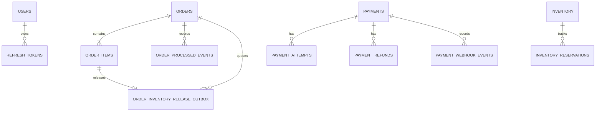

# Schema Design — E-Commerce Platform

**Status:** Current database baseline and planned schema extensions  
**Version:** 1.0  
**Updated:** 12 August 2026

## 1. Design principles

- Each microservice owns its own datastore and migrations; services do not use
  cross-service database foreign keys.
- PostgreSQL stores transactional domain data. Redis stores short-lived cart
  and token-blacklist state.
- UUIDs are the primary identifiers. Timestamps are stored as `TIMESTAMP` in
  the existing migrations.
- Flyway migrations under each service are the source of truth for the current
  physical schema.
- Cross-service references (for example `orders.user_id` or `payments.order_id`)
  are logical identifiers, enforced through API/event contracts rather than SQL
  foreign keys.

## 2. Database ownership

| Service | Store | Schema/tables |
| --- | --- | --- |
| Auth | PostgreSQL `auth_db` | `users`, `refresh_tokens` |
| Product | PostgreSQL `product_db` | `products` |
| Inventory | PostgreSQL `inventory_db` | `inventory`, `inventory_reservations` |
| Order | PostgreSQL `order_db` | `orders`, `order_items`, `order_processed_events`, `order_inventory_release_outbox` |
| Payment | PostgreSQL `payment_db` | `payments`, `payment_attempts`, `payment_refunds`, `payment_webhook_events` |
| Cart | Redis | `cart:{userId}` JSON/object value |
| Auth (secondary) | Redis | JWT blacklist key managed by Auth Service |

## 3. Cross-service logical ERD

The ERD shows ownership relationships only. `orders.user_id`,
`order_items.product_id`, `payments.order_id`, `payments.user_id`, and
`inventory.product_id` intentionally do not reference other service databases.

## 4. Auth schema (`auth_db`)

### `users`

| Column | Type | Rules / purpose |
| --- | --- | --- |
| `id` | UUID | Primary key. |
| `name` | VARCHAR(150) | Required display name. |
| `email` | VARCHAR(255) | Required; unique; indexed. |
| `password` | VARCHAR(255) | Required BCrypt password hash. |
| `role` | VARCHAR(32) | Required role; indexed. |
| `status` | VARCHAR(32) | Required; `ACTIVE`, `INACTIVE`, or `DELETED`; indexed. |
| `token_version` | BIGINT | Required, default `0`; incremented to invalidate sessions. |
| `created_at`, `updated_at` | TIMESTAMP | Required audit timestamps. |

### `refresh_tokens`

| Column | Type | Rules / purpose |
| --- | --- | --- |
| `id` | UUID | Primary key. |
| `user_id` | UUID | Required FK to `users(id)`; cascade delete; indexed. |
| `token` | TEXT | Required refresh-token value. Planned hardening: store a hash only. |
| `expiry` | TIMESTAMP | Required expiration. |

## 5. Product schema (`product_db`)

### `products`

| Column | Type | Rules / purpose |
| --- | --- | --- |
| `id` | UUID | Primary key. |
| `name` | VARCHAR(255) | Required product name. |
| `description` | TEXT | Optional product description. |
| `price` | DECIMAL(10,2) | Required current display price. |
| `category`, `brand` | VARCHAR(255) | Optional browse/filter metadata. |
| `created_at`, `updated_at` | TIMESTAMP | Product audit fields. |

Current physical schema has no image, currency, active/deleted state, version,
price history, or product lifecycle-event tables.

## 6. Inventory schema (`inventory_db`)

### `inventory`

| Column | Type | Rules / purpose |
| --- | --- | --- |
| `id` | UUID | Primary key. |
| `product_id` | UUID | Required and unique logical Product ID. |
| `available_stock` | INT | Required sellable quantity. |
| `reserved_stock` | INT | Required quantity held for orders. |
| `updated_at` | TIMESTAMP | Required last mutation time. |

### `inventory_reservations`

| Column | Type | Rules / purpose |
| --- | --- | --- |
| `id` | UUID | Primary key and stable cross-service reservation ID. |
| `product_id` | UUID | Required logical product ID; indexed. |
| `quantity` | INT | Required; check `quantity > 0`. |
| `status` | VARCHAR(20) | Required: `RESERVED`, `RELEASED`, or `DEDUCTED`. |
| `created_at`, `updated_at` | TIMESTAMP | Required lifecycle audit fields. |

Inventory mutations lock the matching inventory row. Reserve moves available to
reserved; release reverses that move; deduct decreases reserved stock only.

## 7. Order schema (`order_db`)

### `orders`

| Column | Type | Rules / purpose |
| --- | --- | --- |
| `id` | UUID | Primary key. |
| `user_id` | UUID | Required logical Auth user ID; indexed. |
| `total_amount` | DECIMAL(19,2) | Required order total. |
| `currency` | VARCHAR(3) | Required; check uppercase ISO-like three-letter format; indexed. |
| `status` | VARCHAR(32) | Required lifecycle value; indexed. |
| `payment_id` | UUID | Optional logical Payment ID; partial index when present. |
| `payment_confirmed_at`, `payment_failed_at` | TIMESTAMP | Payment-outcome timestamps. |
| `payment_failure_reason` | TEXT | Optional provider failure detail. |
| `shipping_address_id` | UUID | Optional logical address ID for future Address Service; partial index when present. |
| `shipping_recipient_name` | VARCHAR(150) | Order address snapshot. |
| `shipping_phone` | VARCHAR(30) | Order address snapshot. |
| `shipping_line1`, `shipping_line2` | VARCHAR(255) | Order address snapshot. |
| `shipping_city`, `shipping_state` | VARCHAR(100) | Order address snapshot. |
| `shipping_postal_code` | VARCHAR(30) | Order address snapshot. |
| `shipping_country` | VARCHAR(2) | Order address snapshot. |
| `created_at`, `updated_at` | TIMESTAMP | Required audit values; `updated_at` indexed. |

### `order_items`

| Column | Type | Rules / purpose |
| --- | --- | --- |
| `id` | UUID | Primary key. |
| `order_id` | UUID | Required FK to `orders`; cascade delete; indexed. |
| `product_id` | UUID | Required logical Product ID; indexed. |
| `quantity` | INT | Required order quantity. |
| `price` | DECIMAL(19,2) | Required item price snapshot. |
| `inventory_reservation_id` | UUID | Optional stable reservation ID; unique when non-null. |

### `order_processed_events`

| Column | Type | Rules / purpose |
| --- | --- | --- |
| `id` | UUID | Primary key. |
| `event_id` | UUID | Required unique Kafka event identity. |
| `event_type` | VARCHAR(100) | Required event classification. |
| `order_id` | UUID | Required logical order ID; indexed. |
| `processed_at` | TIMESTAMP | Required inbox timestamp. |

### `order_inventory_release_outbox`

| Column | Type | Rules / purpose |
| --- | --- | --- |
| `id` | UUID | Primary key. |
| `order_id` | UUID | Required FK to `orders`; cascade delete; indexed. |
| `order_item_id` | UUID | Required FK to `order_items`; cascade delete. |
| `reservation_id` | UUID | Required; unique, so one reservation has one release command. |
| `product_id` | UUID | Required logical inventory product ID. |
| `quantity` | INT | Required; check `> 0`. |
| `reason` | VARCHAR(32) | Required: `PAYMENT_FAILED` or `CANCELLED`. |
| `status` | VARCHAR(16) | Required, default `PENDING`: `PENDING` or `COMPLETED`. |
| `attempt_count` | INT | Required retry count, default `0`. |
| `last_error` | TEXT | Latest retry failure detail. |
| `created_at`, `updated_at`, `completed_at` | TIMESTAMP | Work lifecycle timestamps. |

The `(status, created_at)` index supports worker polling for pending commands.

## 8. Payment schema (`payment_db`)

### `payments`

| Column | Type | Rules / purpose |
| --- | --- | --- |
| `id` | UUID | Primary key. |
| `order_id`, `user_id` | UUID | Required logical Order/Auth IDs; `order_id` unique and `user_id` indexed. |
| `amount` | NUMERIC(19,2) | Required; check `> 0`. |
| `currency` | VARCHAR(3) | Required uppercase three-character value. |
| `status` | VARCHAR(40) | Required payment lifecycle state; indexed. |
| `provider` | VARCHAR(40) | Required: `STRIPE`, `RAZORPAY`, or `SANDBOX`; indexed. |
| `idempotency_key` | VARCHAR(150) | Required unique preparation idempotency key. |
| `failure_reason` | TEXT | Optional payment failure detail. |
| `correlation_id`, `trace_id` | VARCHAR(128) | Optional observability correlation; partial indexes when present. |
| `version` | BIGINT | Required optimistic version, default `0`. |
| `created_at`, `updated_at` | TIMESTAMP | Required audit timestamps. |

Payment statuses are `PENDING`, `REQUIRES_CUSTOMER_ACTION`, `PROCESSING`,
`SUCCESS`, `FAILED`, `CANCELLED`, `REFUND_REQUESTED`, `REFUND_PROCESSING`,
`REFUNDED`, and `REFUND_FAILED`.

### `payment_attempts`

| Column | Type | Rules / purpose |
| --- | --- | --- |
| `id` | UUID | Primary key. |
| `payment_id` | UUID | Required FK to `payments`; cascade delete; indexed. |
| `provider` | VARCHAR(40) | Required supported provider. |
| `provider_session_id`, `provider_payment_intent_id`, `provider_charge_id` | VARCHAR(255) | Optional provider identifiers; uniqueness/indexes protect matching. |
| `checkout_url` | TEXT | Optional hosted checkout URL. |
| `status` | VARCHAR(40) | Required attempt state: `CREATED`, `REQUIRES_CUSTOMER_ACTION`, `PROCESSING`, `SUCCESS`, `FAILED`, `CANCELLED`, `EXPIRED`. |
| `idempotency_key` | VARCHAR(150) | Optional; unique per payment when present. |
| `failure_reason` | TEXT | Optional provider failure detail. |
| `expires_at` | TIMESTAMP | Optional expiry; partial index. |
| `created_at`, `updated_at` | TIMESTAMP | Required audit timestamps. |

### `payment_refunds`

| Column | Type | Rules / purpose |
| --- | --- | --- |
| `id` | UUID | Primary key. |
| `payment_id` | UUID | Required FK to `payments`; cascade delete; indexed. |
| `amount` | NUMERIC(19,2) | Required; check `> 0`. |
| `currency` | VARCHAR(3) | Required uppercase three-character value. |
| `provider_refund_id` | VARCHAR(255) | Optional unique provider ID. |
| `status` | VARCHAR(40) | Required: requested, processing, refunded, or failed. |
| `reason`, `failure_reason` | TEXT | Optional request/failure information. |
| `idempotency_key` | VARCHAR(150) | Required unique request key. |
| `created_at`, `updated_at` | TIMESTAMP | Required audit timestamps. |

### `payment_webhook_events`

| Column | Type | Rules / purpose |
| --- | --- | --- |
| `id` | UUID | Primary key. |
| `provider`, `provider_event_id` | VARCHAR(40), VARCHAR(255) | Required; pair is unique for webhook deduplication. |
| `payment_id` | UUID | Optional FK to `payments`; set null on payment delete; indexed. |
| `event_type` | VARCHAR(150) | Required provider event name. |
| `processing_status` | VARCHAR(40) | Required: `RECEIVED`, `PROCESSED`, `IGNORED`, `FAILED`; indexed. |
| `payload_hash` | VARCHAR(128) | Optional payload integrity/audit hash. |
| `received_at`, `processed_at` | TIMESTAMP | Receipt and completion audit values. |

## 9. Redis logical schema

| Key | Value | TTL | Owner |
| --- | --- | --- | --- |
| `cart:{userId}` | Cart object: user ID, items (`itemId`, `productId`, quantity), `updatedAt` | Seven days after each save | Cart Service |
| Token blacklist key | JWT `jti`/blacklist entry | Until token expiry | Auth Service |

Redis must not become the source of truth for orders, payments, inventory, or
users. Cart reads do not refresh TTL; only writes do.

## 10. Planned schema extensions

| Capability | Proposed tables / key fields |
| --- | --- |
| Transactional outbox | Per owning service `*_outbox(id, aggregate_id, event_type, payload, status, attempts, created_at, published_at)` with pending-work index. |
| Address Service | `addresses(id, user_id, recipient, phone, line1, line2, city, state, postal_code, country, is_default, timestamps)`. Orders keep their immutable snapshot. |
| Shipping/Fulfilment | `shipments`, `shipment_items`, `tracking_events`; use order and reservation IDs, not cross-database FKs. |
| Notifications | `notifications`, `notification_deliveries`, `notification_templates`, `notification_preferences`. |
| Pricing | `coupons`, `coupon_rules`, `promotions`, `promotion_redemptions`, `price_adjustments`. |
| Search | Elasticsearch product index plus an indexing outbox/checkpoint table. |
| Reviews | `reviews(id, product_id, user_id, order_item_id, rating, content, moderation_status, timestamps)`. |
| Product lifecycle | `product_images`, `product_prices`, `product_status_history`, optional `product_version`. |

## 11. Integrity and retention rules

1. Keep product/order/payment monetary snapshots immutable after transaction
   creation; new catalog/pricing records must not rewrite historical order value.
2. Never delete a reservation ledger row needed for idempotency/reconciliation.
3. Retain processed events, webhook audit records, and outbox status long enough
   for retry, reconciliation, incident investigation, and policy obligations.
4. Add explicit retention/anonymization policy for soft-deleted users, tokens,
   payment metadata, operational logs, and personal address fields before
   production rollout.
5. Future database migrations must be backward-compatible for rolling service
   deployments and include indexes supporting each polling/query path.

## 12. Migration and reference locations

Current migrations reside in each service's
`src/main/resources/db/migration/` directory. Related design references are the
[HLD](high-level-design.md), [LLD](low-level-design.md), and
[requirements specification](requirements-specification.md).
