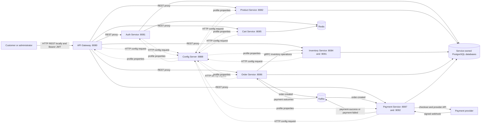
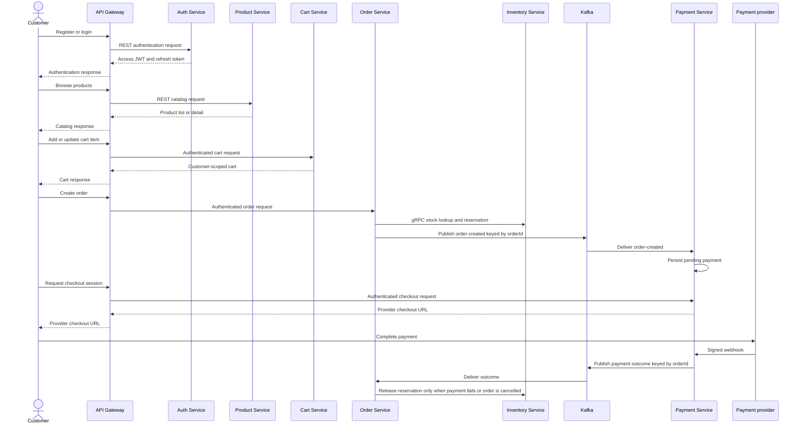

# Service Documentation

> **Scope:** the eight runnable services in the current Maven reactor. This is
> a source-grounded guide to what is implemented today, not a target
> architecture.

The detailed order, payment, and inventory saga is documented separately in
[Order, Payment, and Inventory Saga Design](../order-payment-inventory-saga-design.md).

## Service catalog

| Service | Local port | Primary responsibility | Storage | Main integration |
| --- | ---: | --- | --- | --- |
| [Config Server](config-server.md) | 8888 | Intended configuration authority backed by Git. | Runtime Git checkout/cache | HTTP Spring Cloud Config API |
| [API Gateway](gateway-service.md) | 8080 | Public REST entry point, JWT validation, CORS, routing. | None; Redis capability is available | HTTP reverse proxy |
| [Auth Service](auth-service.md) | 8081 | Accounts, token issuance, refresh, logout, and user administration. | PostgreSQL and Redis blacklist | REST, JWT/JWK, OAuth2/OIDC endpoints |
| [Product Service](product-service.md) | 8082 | Product catalog and admin catalog management. | PostgreSQL `product_db` | REST only |
| [Inventory Service](inventory-service.md) | 8084 REST, 9091 gRPC | Available/reserved stock and reservation ledger. | PostgreSQL `inventory_db` | REST and gRPC |
| [Cart Service](cart-service.md) | 8085 | Customer-scoped temporary cart. | Redis | REST only |
| [Order Service](order-service.md) | 8086 | Orders, inventory reservation, payment outcomes, compensation. | PostgreSQL `order_db` | REST, gRPC client, Kafka |
| [Payment Service](payment-service.md) | 8087 REST, 9092 gRPC | Checkout, provider webhooks, payment attempts, refunds. | PostgreSQL `payment_db` | REST, gRPC server, Kafka |

All business-service port, database, broker, JWT issuer, and gateway-route
settings are loaded from the external configuration repository at runtime.
The values above are the local development values documented in this repository.

## Platform architecture

## Customer journey across services

Cart is not automatically converted into an order in the current code. The
frontend must submit a valid order request; Order Service does not fetch the
cart or Product Service prices during creation.

## Communication matrix

| From | To | Transport | Why |
| --- | --- | --- | --- |
| Gateway and business services | Config Server | HTTP | Request profile-specific settings on startup. |
| Customer application | Gateway | HTTP REST locally; HTTPS when deployment infrastructure terminates TLS | Public API access with JWT. |
| Gateway | Business services | HTTP REST proxy | Route public requests to the owning service. |
| Gateway and business services | Auth Service JWK endpoints | HTTP/JWT | Verify tokens issued by Auth Service. |
| Order Service | Inventory Service | gRPC | Check, reserve, and release stock. |
| Order Service | Kafka | Producer | Publish `order-created`. |
| Payment Service | Kafka | Consumer and producer | Prepare payment, then emit an outcome. |
| Payment provider | Payment Service | HTTPS webhook | Report authoritative payment result. |

## Shared platform components

| Component | Role | Current implementation note |
| --- | --- | --- |
| PostgreSQL | Durable data per transactional service | Auth, Product, Inventory, Order, and Payment own separate databases and Flyway migrations. |
| Redis | Ephemeral/session-oriented data | Cart uses customer carts; Auth uses a JWT blacklist. Gateway has rate-limit support but active routes do not currently use the filter. |
| Kafka | Cross-service domain events | Local topics: `order-created`, `payment-success`, `payment-failed`, `order-dlq`. |
| Prometheus and Grafana | Metrics and dashboards | Services expose Actuator Prometheus endpoints; an Order payment-outcome dashboard is provisioned. |
| OpenTelemetry and Tempo | Traces | W3C trace propagation and profile-configured OTLP export. |
| Loki and Alloy | Logs | Services write structured JSON. Local Compose starts Loki, but no local log shipper currently forwards host logs to it. |

## Documentation map

| Document | Use it to understand |
| --- | --- |
| [Config Server](config-server.md) | How runtime settings reach services. |
| [API Gateway](gateway-service.md) | Public routes, authorization, CORS, and gateway limits. |
| [Auth Service](auth-service.md) | Registration, login, JWT claims, refresh tokens, and administration. |
| [Product Service](product-service.md) | Catalog browsing and admin product CRUD. |
| [Inventory Service](inventory-service.md) | Stock administration and reservation-aware gRPC contracts. |
| [Cart Service](cart-service.md) | Redis cart behavior and lifecycle. |
| [Order Service](order-service.md) | Order lifecycle and the contract with inventory, Kafka, and payment. |
| [Payment Service](payment-service.md) | Checkout, webhook processing, provider support, and refunds. |
| [Saga design](../order-payment-inventory-saga-design.md) | The full payment outcome and inventory-compensation design. |

## Shared modules

The `common/` directory contains reusable code, not independently deployed
services:

| Module | Purpose |
| --- | --- |
| `common-events` | Kafka domain event contracts and topic names. |
| `common-exception` | Common domain and HTTP error handling. |
| `common-grpc` and `common-proto` | gRPC factory, tracing/error mapping, and protobuf contracts. |
| `common-redis` | Redis configuration and key helpers. |
| `common-security` | JWT authority conversion and common security helpers. |
| `common-tracing` | Trace propagation and response header support. |

## Configuration layout caveat

Config Server currently has no Git `search-paths` setting, while the referenced
configuration repository stores environment files under `dev/`, `stage/`, and
`prod/` directories. As checked in, Config Server cannot reliably serve a
request such as `/order-service/dev` from `dev/order-service-dev.yml` until
that layout/configuration mismatch is resolved. Treat external runtime YAML as
the intended source of truth, not a verified working bootstrap path.
