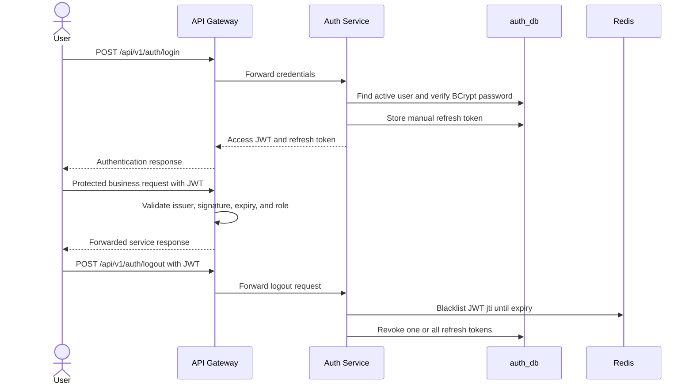
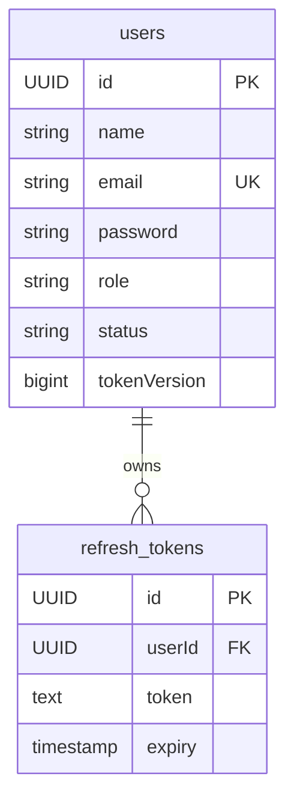

# Auth Service

## What it does

Auth Service owns accounts, custom registration/login/refresh/logout flows,
JWT issuance, refresh-token lifecycle, user self-service, and administrative
user management. It also has OAuth2/OIDC Authorization Server framework
configuration, although the custom REST token flow is the path used by the
current business services.

| Concern | Current behavior |
| --- | --- |
| Local port | 8081 |
| Protocols | REST JSON, JWT/JWK, OAuth2/OIDC framework endpoints |
| Primary data | PostgreSQL users and refresh tokens |
| Secondary data | Redis JWT blacklist keyed by token `jti` |
| Token signing | Runtime-generated 2048-bit RSA key pair and JWK set |
| Messaging and gRPC | None |
| Observability | Actuator, Prometheus, tracing, structured JSON logs, OpenAPI |

## Customer login and protected-request flow

## REST API

| Method | Endpoint | Access | Purpose |
| --- | --- | --- | --- |
| POST | `/api/v1/auth/register` | Public | Create an active customer and return token pair. |
| POST | `/api/v1/auth/login` | Public | Verify credentials and return token pair. |
| POST | `/api/v1/auth/refresh` | Public with refresh token | Rotate manual refresh token and issue a new pair. |
| POST | `/api/v1/auth/logout` | Bearer JWT | Blacklist current access token and revoke supplied/all refresh tokens. |
| GET | `/api/v1/users/me` | Bearer JWT | Read current profile. |
| PUT | `/api/v1/users/me` | Bearer JWT | Update current user's name. |
| DELETE | `/api/v1/users/me` | Bearer JWT | Soft-delete own account and invalidate sessions. |
| GET | `/api/v1/admin/users` | `ADMIN` | Paginated user list. |
| GET | `/api/v1/admin/users/{id}` | `ADMIN` | User detail. |
| DELETE | `/api/v1/admin/users/{id}` | `ADMIN` | Soft-delete another user. |
| PUT | `/api/v1/admin/users/{id}/role` | `ADMIN` | Change role and invalidate sessions. |
| POST | `/api/v1/admin/users/{id}/logout` | `ADMIN` | Invalidate target user's sessions. |

## Token contract

| JWT claim | Meaning |
| --- | --- |
| `iss` | Issuer, currently `http://localhost:8081` in the authorization-server configuration. |
| `sub` | User email. |
| `jti` | Unique access-token identifier used by the blacklist. |
| `userId` | User UUID used by downstream services for ownership. |
| `role` | `CUSTOMER` or `ADMIN`; converted to `ROLE_*` authority. |
| `status` | Current user status. |
| `tokenVersion` | Incremented when sessions are invalidated. |
| `iat`, `exp` | Token issued and expiry times. |

## Data model

## Security and lifecycle rules

- Registration creates an active `CUSTOMER` and hashes its password with BCrypt.
- Deletion is soft deletion and increments the token version.
- Role change and forced logout revoke existing refresh tokens.
- Auth Service's own decoder checks blacklist, status, and token version.
- Other services and the gateway validate standard JWT material from the issuer
  and JWK source; they do not share Auth Service's Redis blacklist directly.

## Current limitations

- RSA signing keys and the OAuth registered-client repository are in memory;
  restarting Auth Service changes the JWK material and invalidates prior token
  verification material.
- The authorization-server issuer is hard-coded to localhost rather than a
  stage/prod external issuer.
- Manual refresh tokens are stored as raw values in PostgreSQL rather than
  hashes.
- Gateway does not immediately enforce Auth Service blacklist/status/version
  changes from this repository's code alone.
- No MFA, email verification, password reset, or account recovery is present.
- OAuth/OIDC framework endpoints are not actively routed by Gateway and no
  dedicated interactive login flow is defined here.

## Main implementation locations

| Concern | Location |
| --- | --- |
| Public auth API | `auth-service/src/main/java/com/ecommerce/auth/controller/AuthController.java` |
| Profile and admin APIs | `auth-service/src/main/java/com/ecommerce/auth/controller/` |
| Login and refresh lifecycle | `auth-service/src/main/java/com/ecommerce/auth/service/AuthService.java` |
| JWT creation | `auth-service/src/main/java/com/ecommerce/auth/service/JwtTokenService.java` |
| Refresh tokens and blacklist | `auth-service/src/main/java/com/ecommerce/auth/service/RefreshTokenService.java`, `TokenBlacklistService.java` |
| Security and JWK/OAuth setup | `auth-service/src/main/java/com/ecommerce/auth/config/` |
| Schema | `auth-service/src/main/resources/db/migration/` |
