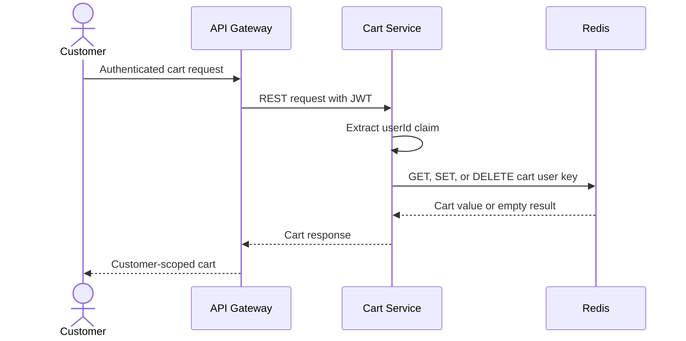
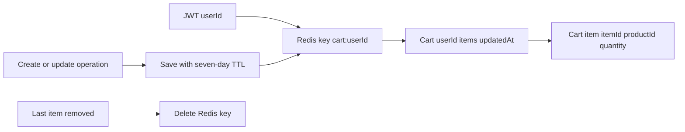

# Cart Service

## What it does

Cart Service owns a temporary, customer-scoped shopping cart in Redis. It uses
the authenticated JWT `userId` claim as the cart owner, stores the full cart as
a Redis value, and expires each saved cart after seven days. It does not yet
validate product existence, stock, or pricing.

| Concern | Current behavior |
| --- | --- |
| Local port | 8085 |
| Store | Redis |
| Key | `cart:{userId}` |
| TTL | Seven days every time the cart is saved |
| API style | Authenticated REST JSON |
| Async messaging | None |
| gRPC | None |
| Observability | Actuator, Prometheus, tracing, structured JSON logs |

## Customer cart flow

When a customer adds a product already present in its cart, the service
increments that item's quantity instead of creating a second item. Removing the
last item deletes the Redis key.

## REST API

| Method | Endpoint | Access | Behavior |
| --- | --- | --- | --- |
| POST | `/api/v1/cart` | Bearer JWT | Add an item or increment quantity for an existing product. |
| PUT | `/api/v1/cart/{itemId}` | Bearer JWT | Set the quantity of one cart item. |
| GET | `/api/v1/cart` | Bearer JWT | Return the current user's cart; creates/persists an empty cart if absent. |
| DELETE | `/api/v1/cart/{itemId}` | Bearer JWT | Remove one item; deletes cart key when no items remain. |
| DELETE | `/api/v1/cart` | Bearer JWT | Delete the entire current user's cart. |

## Cart data model and lifecycle

| Field | Ownership | Notes |
| --- | --- | --- |
| `userId` | Derived from JWT | Customers cannot choose another user's cart. |
| `itemId` | Cart Service | Used for item update/removal path. |
| `productId` | Request payload | Stored as a string; not validated against Product Service. |
| `quantity` | Request payload | Managed in the cart object. |
| `updatedAt` | Cart Service | Updated when cart is saved. |

## Security and operational behavior

- All cart endpoints require a valid JWT.
- The service uses only the `userId` claim to derive ownership; there is no
  user ID parameter in the endpoint.
- Redis reads do not refresh TTL. Only cart saves refresh the seven-day expiry.
- If a cart does not exist, `GET /api/v1/cart` creates and saves an empty cart.

## Current limitations

- Cart Service does not call Product Service, Inventory Service, Order Service,
  or Kafka.
- Cart entries can therefore refer to deleted/unknown products or quantities
  that are unavailable at checkout.
- There is no automatic cart-to-order handoff.
- Concurrent read-modify-write operations have no distributed lock, optimistic
  version, or atomic Redis update and may overwrite each other.
- The controller assumes a non-empty JWT `userId` claim when forming the Redis
  key; it does not validate that claim explicitly.

## Main implementation locations

| Concern | Location |
| --- | --- |
| REST controller | `cart-service/src/main/java/com/ecommerce/cart/controller/CartController.java` |
| Cart behavior | `cart-service/src/main/java/com/ecommerce/cart/service/CartService.java` |
| Redis persistence | `cart-service/src/main/java/com/ecommerce/cart/repository/CartRedisRepository.java` |
| Cart models | `cart-service/src/main/java/com/ecommerce/cart/model/` |
| Redis key helper | `common/common-redis/src/main/java/com/ecommerce/common/redis/key/RedisKeys.java` |
| Security | `cart-service/src/main/java/com/ecommerce/cart/config/SecurityConfig.java` |

