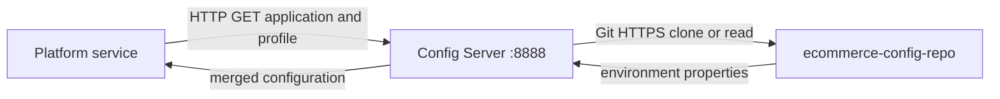

# Config Server

## What it does

Config Server is intended to be the platform's configuration authority. It
clones the `ecommerce-config-repo` Git repository at startup and exposes Spring
Cloud Config endpoints to Gateway and the business services. It does not own
application business data.

| Concern | Current behavior |
| --- | --- |
| Local port | 8888 |
| Protocol | HTTP Spring Cloud Config API |
| Backend | GitHub repository `pepetibalaji/ecommerce-config-repo`, `main` branch |
| Startup | `clone-on-start: true` |
| Persistent store | Runtime Git checkout/cache; no configured durable `basedir` or application database |
| Consumers | Gateway, Auth, Product, Inventory, Cart, Order, and Payment Services |
| Operations endpoints | Health, info, refresh, Prometheus |

## Service startup flow

Each service has a small local `application.yml` that identifies its application
name, active profile, and optional `CONFIG_SERVER_URL`. Database credentials,
Kafka settings, JWT issuer values, ports, and gateway route destinations are
normally supplied by the external configuration repository.

## Interface

| Request | Use |
| --- | --- |
| `GET /{application}/{profile}` | Retrieve properties for a named service and environment, such as `/order-service/dev`. |
| `GET /actuator/health` | Check Config Server health. |
| `GET /actuator/prometheus` | Expose metrics to Prometheus. |
| `POST /actuator/refresh` | Refresh Config Server context; exposed by configuration and no module-level security policy is defined here. |

These are Spring Cloud Config and Actuator contracts rather than custom business
REST APIs.

## Operational flow

| Stage | Responsibility | Failure impact |
| --- | --- | --- |
| Clone | Fetch configuration Git repository during startup. | With `clone-on-start`, Git unavailability can prevent a healthy startup. |
| Serve | Respond to a service's application/profile request. | A bootstrapping service can fall back only because its import is declared optional. |
| Observe | Emit structured logs and Actuator metrics. | Config health and Git access problems must be monitored. |

## Security and observability

- Health details are configured to be shown; restrict access outside trusted
  environments.
- Structured JSON logs are written locally and Actuator exposes health, info,
  refresh, and Prometheus endpoints.
- Configuration values should not include committed secrets; runtime secrets
  are supplied through ignored environment files or deployment secrets.

## Current limitations

- There is no repository webhook, polling strategy, or platform-wide automatic
  refresh workflow in this repository.
- Config Server has no Git `search-paths`, but the referenced configuration
  repository stores files beneath `dev/`, `stage/`, and `prod/`. As a result,
  it cannot reliably serve `/service/profile` from that layout until a
  search-path or repository-layout fix is applied.
- The Git backend is hard-coded in the local Config Server YAML, making the
  repository itself a startup dependency.
- A service can start without Config Server because imports are optional, but
  it may then lack critical route, database, broker, or security settings.

## Main implementation locations

| Concern | Location |
| --- | --- |
| Application | `config-server/src/main/java/com/ecommerce/configserver/ConfigServerApplication.java` |
| Server configuration | `config-server/src/main/resources/application.yml` |
| Local bootstrap clients | `*/src/main/resources/application.yml` |
