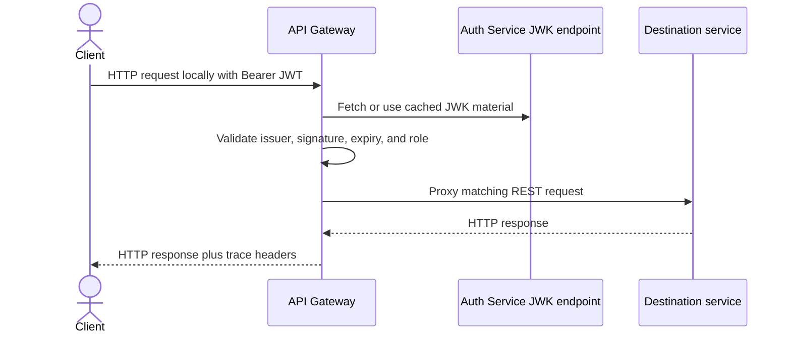
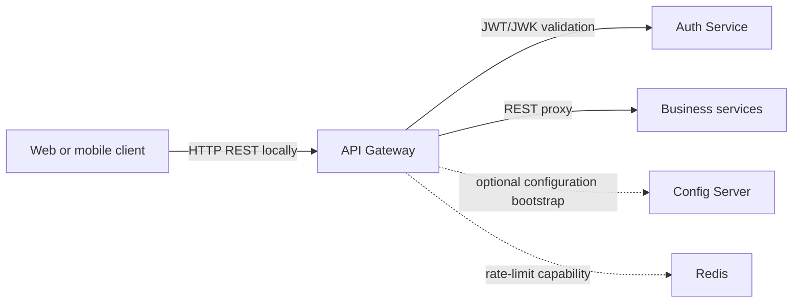

# API Gateway

## What it does

Gateway is the public reactive HTTP entry point. It validates bearer JWTs,
applies CORS rules, proxies REST requests to the owning service, and exposes
gateway/health/Prometheus diagnostics. Route definitions are supplied at
runtime by Config Server rather than stored in this module.

| Concern | Current behavior |
| --- | --- |
| Local port | 8080 |
| Framework | Spring Cloud Gateway WebFlux |
| Authentication | OAuth2 Resource Server with Auth Service issuer/JWK configuration |
| Service discovery | None; routes use configured downstream URIs |
| Global timeout | 1-second connect timeout and 5-second response timeout |
| Bulk catalog exception | Product bulk-create route allows a 30-second response timeout |
| Storage | None; Redis support exists for rate-limit identity/state |
| Observability | Health, info, Prometheus, gateway actuator, JSON logs, tracing |

## Public request flow

Authentication endpoints remain public, so registration, login, and refresh
reach Auth Service without a bearer token.

## Current route map

| Gateway path | Destination | Notes |
| --- | --- | --- |
| `/api/v1/auth/**`, `/api/v1/users/**`, `/api/v1/admin/users/**` | Auth Service | Register/login/refresh are public; user/admin routes are secured. |
| `/api/v1/products/**`, `/api/v1/admin/products/**` | Product Service | Bulk create has a longer response timeout. |
| `/api/v1/inventory/**`, `/api/v1/admin/inventory/**` | Inventory Service | Current service exposes admin inventory REST APIs. |
| `/api/v1/cart/**` | Cart Service | Authenticated customer cart APIs. |
| `/api/v1/orders/**`, `/api/v1/admin/orders/**` | Order Service | Customer and admin order APIs. |
| `/api/v1/payments/**`, `/api/v1/admin/payments/**` | Payment Service | Customer and admin payment APIs. |
| `/{service}/v3/api-docs` | Corresponding service | OpenAPI aggregation in dev/stage. |

## Access policy

| Request category | Rule |
| --- | --- |
| Register, login, refresh, health, info, Prometheus, OpenAPI | Public |
| `/api/v1/admin/**`, `/api/v1/ai/**`, `/mcp/**` | `ADMIN` role |
| Other configured routes | Authenticated user |
| CORS | Configurable allowed origins; credentials enabled; trace headers exposed |
| Rate-limit identity | JWT `userId`, then JWT subject, otherwise client IP |

The shared authority converter maps the JWT `role` claim to Spring
`ROLE_<role>` authorities.

## Gateway dependencies

## Current limitations and deployment notes

- The local gateway configuration supports rate-limit keys and fallback
  responses, but the active dev/stage/prod route YAML does not currently apply
  `RequestRateLimiter` or circuit-breaker filters.
- `/oauth2/**` and `/.well-known/**` are allowed by gateway security but have
  no active route to Auth Service. Access those Auth Service endpoints directly
  until routes are added.
- `/public/payments/**` is not routed. Provider return pages using those URLs
  require direct Payment Service exposure or a gateway route.
- Gateway's Config Server import is optional. Without external configuration it
  can start but has no locally declared business-service routes.
- `docs/gateway-configuration.md` contains illustrative route filters; treat
  the external runtime YAML as the active source of truth.

## Main implementation locations

| Concern | Location |
| --- | --- |
| Bootstrap and HTTP client timeouts | `gateway-service/src/main/resources/application.yml` |
| JWT and CORS policy | `gateway-service/src/main/java/com/ecommerce/gateway/config/SecurityConfig.java` |
| Rate-limit key logic | `gateway-service/src/main/java/com/ecommerce/gateway/config/GatewayRateLimitConfig.java` |
| Dependency errors and fallback response | `gateway-service/src/main/java/com/ecommerce/gateway/error/` |
| Active routes | External `ecommerce-config-repo` gateway YAML files |
