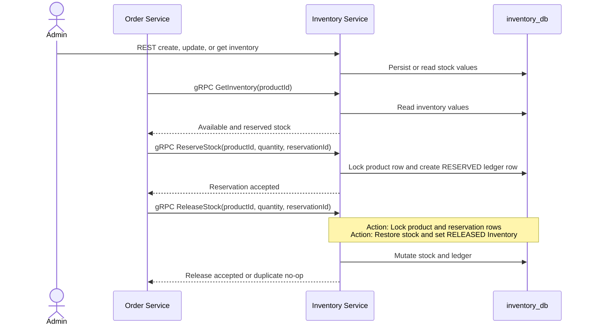
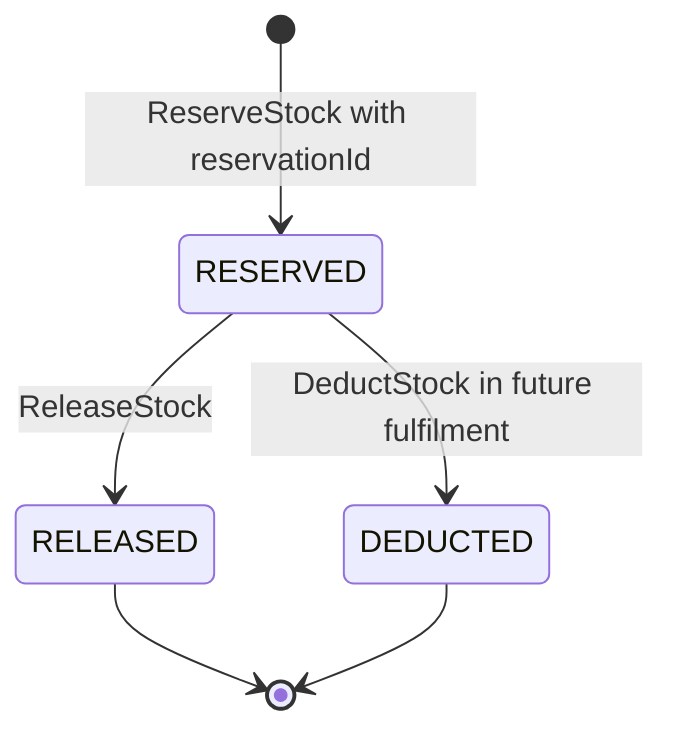
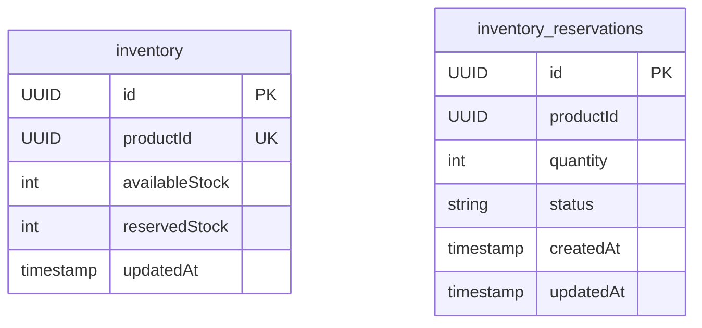

# Inventory Service

## What it does

Inventory Service owns available and reserved stock for a product and the
reservation ledger that makes distributed retries safe. Administrators manage
stock through REST. Order Service calls the gRPC interface to check, reserve,
and later release stock. A future fulfilment service should use `DeductStock`.

| Concern         | Current behavior                                                                  |
| --------------- | --------------------------------------------------------------------------------- |
| Local ports     | 8084 REST and 9091 gRPC                                                           |
| Store           | PostgreSQL `inventory_db`                                                         |
| Tables          | `inventory`, `inventory_reservations`                                             |
| REST security   | Business REST APIs require `ADMIN`; diagnostics/OpenAPI are permitted separately. |
| gRPC callers    | Current Order Service integration                                                 |
| Async messaging | None                                                                              |
| Consistency     | Pessimistic product-row locking for reservation-aware mutations                   |
| Observability   | Actuator, Prometheus, tracing, structured JSON logs                               |

## Administration and order-reservation flow

## Reservation state machine

| Operation | Balance change                                                | Retry behavior                               |
| --------- | ------------------------------------------------------------- | -------------------------------------------- |
| Reserve   | `availableStock` decreases; `reservedStock` increases.        | A matching already-`RESERVED` ID is a no-op. |
| Release   | `reservedStock` decreases; `availableStock` increases.        | A matching already-`RELEASED` ID is a no-op. |
| Deduct    | `reservedStock` decreases; available stock remains unchanged. | A matching already-`DEDUCTED` ID is a no-op. |

Releasing a `DEDUCTED` reservation or deducting a `RELEASED` reservation is a
business conflict. The mutation must match the ledger's `productId` and
`quantity` exactly.

## REST API

| Method | Endpoint                              | Access  | Behavior                                       |
| ------ | ------------------------------------- | ------- | ---------------------------------------------- |
| POST   | `/api/v1/admin/inventory`             | `ADMIN` | Create an inventory record for a product UUID. |
| PUT    | `/api/v1/admin/inventory/{productId}` | `ADMIN` | Set available stock for the product.           |
| GET    | `/api/v1/admin/inventory/{productId}` | `ADMIN` | Read available and reserved stock.             |

## gRPC API

| RPC            | Caller                    | Request                                | Result                                                   |
| -------------- | ------------------------- | -------------------------------------- | -------------------------------------------------------- |
| `GetInventory` | Order Service             | `productId`                            | Product ID, available stock, reserved stock.             |
| `ReserveStock` | Order Service             | `productId`, quantity, `reservationId` | Success/message; creates or safely reuses a reservation. |
| `ReleaseStock` | Order release worker      | `productId`, quantity, `reservationId` | Success/message; compensates one reservation.            |
| `DeductStock`  | Future fulfilment service | `productId`, quantity, `reservationId` | Success/message; consumes a fulfilled reservation.       |

The protobuf contract retains quantity-only mutations for rolling deployment
compatibility. New callers must include `reservationId`, because legacy
quantity-only calls cannot be safely deduplicated.

## Data ownership

`inventory_reservations.id` is the stable cross-service reservation ID. It is
logically associated with `inventory` by `product_id`, but the migration does
not define a database foreign key between those tables. There is an index on
the reservation product ID and no Product Service foreign key because the
services have separate databases.

## Security, errors, and operations

- Admin REST routes require `ROLE_ADMIN`.
- The gRPC server propagates tracing context, but this repository has no gRPC
  authentication/authorization interceptor.
- Not-found inventory maps to gRPC `NOT_FOUND`; validation and business-rule
  failures map to `FAILED_PRECONDITION`.
- Reservation-aware mutations lock the product row in a local transaction so
  concurrent same-product operations serialize.

## Current limitations

- Inventory Service does not call Product Service or validate that a product
  UUID exists.
- It publishes no Kafka inventory events.
- Legacy quantity-only gRPC mutations remain and are not idempotent.
- Admin updates overwrite `availableStock` independently of `reservedStock`;
  they do not enforce a broader stock-reconciliation invariant.
- No service currently calls `DeductStock`; payment success deliberately leaves
  stock reserved until fulfilment is implemented.

## Main implementation locations

| Concern               | Location                                                                                      |
| --------------------- | --------------------------------------------------------------------------------------------- |
| Admin REST API        | `inventory-service/src/main/java/com/ecommerce/inventory/controller/InventoryController.java` |
| Reservation semantics | `inventory-service/src/main/java/com/ecommerce/inventory/service/InventoryService.java`       |
| gRPC implementation   | `inventory-service/src/main/java/com/ecommerce/inventory/grpc/InventoryGrpcService.java`      |
| gRPC contract         | `common/common-proto/src/main/proto/inventory.proto`                                          |
| Security and tracing  | `inventory-service/src/main/java/com/ecommerce/inventory/config/`, `grpc/`                    |
| Schema                | `inventory-service/src/main/resources/db/migration/`                                          |
