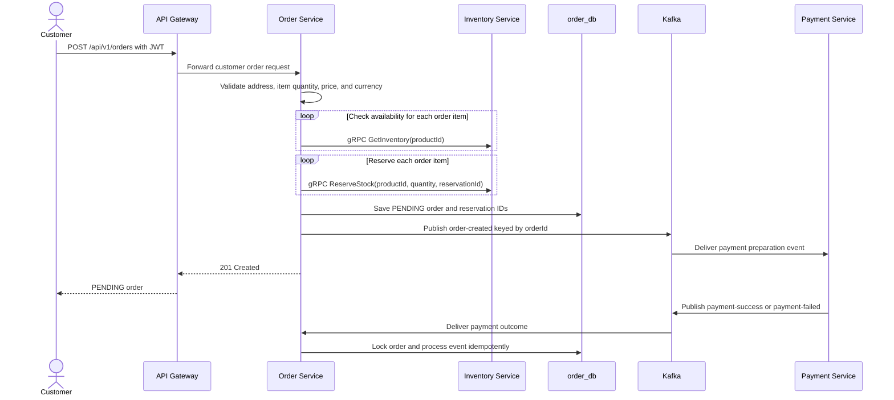
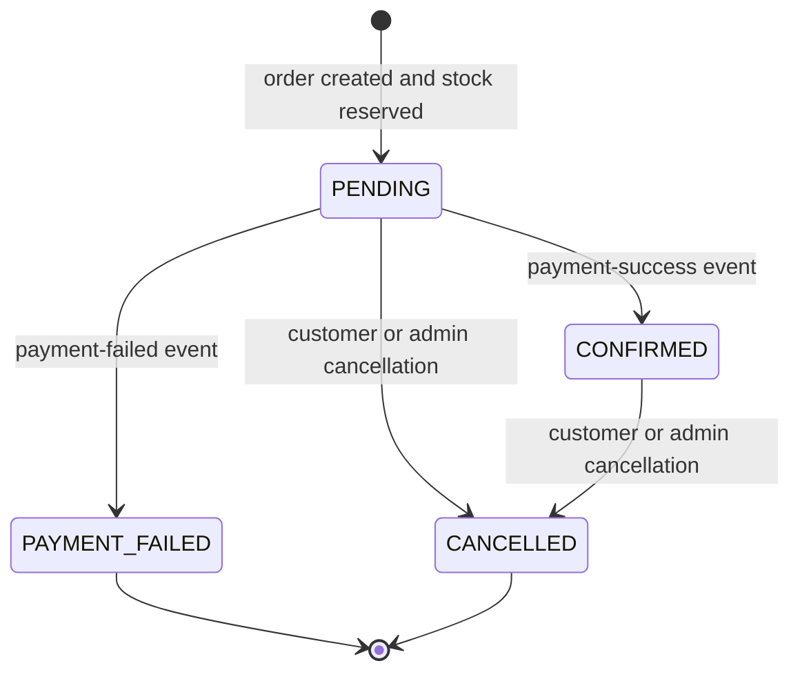
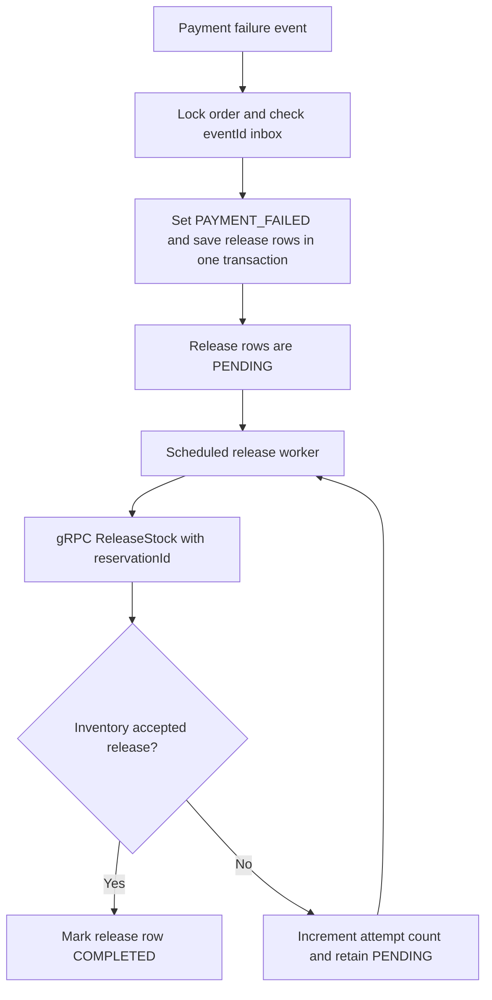
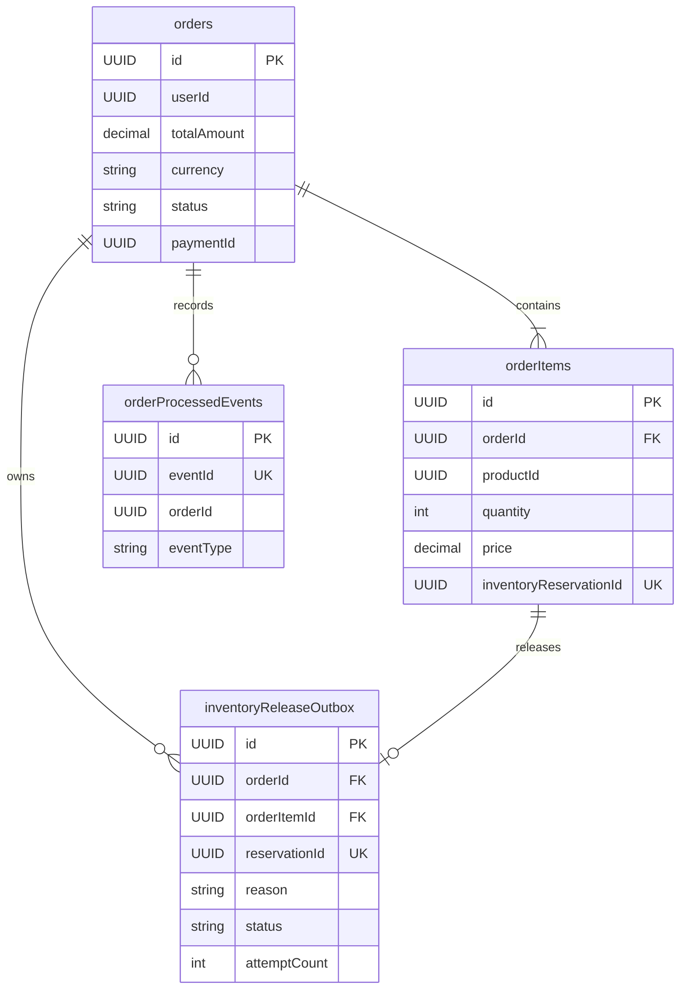

# Order Service

## What it does

Order Service owns customer orders and the current order/payment/inventory
reservation lifecycle. It creates `PENDING` orders, reserves stock
synchronously, publishes `order-created`, consumes payment outcomes, and
creates durable Inventory release commands when a payment fails or an order is
cancelled.

For the complete cross-service design, database ERD, retry rules, and rollout
sequence, see [Order, Payment, and Inventory Saga Design](../order-payment-inventory-saga-design.md).

| Concern | Current behavior |
| --- | --- |
| Local port | 8086 |
| Store | PostgreSQL `order_db` |
| Tables | `orders`, `order_items`, `order_processed_events`, `order_inventory_release_outbox` |
| Customer interface | REST with JWT `userId` ownership checks |
| Admin interface | REST with `ADMIN` role |
| gRPC client | Inventory `GetInventory`, `ReserveStock`, `ReleaseStock` |
| Kafka output | `order-created`, keyed by `orderId` |
| Kafka inputs | `payment-success`, `payment-failed` |
| Observability | Actuator, Prometheus, tracing, structured JSON logs, payment-outcome dashboard |

## Customer create-order and payment flow

The input includes product IDs, quantities, and client-supplied prices. Order
Service validates request shape but does not call Product Service to verify
catalog existence or price. Inventory is the current stock authority.

## REST API

| Method | Endpoint | Access | Behavior |
| --- | --- | --- | --- |
| POST | `/api/v1/orders` | Bearer JWT | Create a `PENDING` order after reserving stock. |
| GET | `/api/v1/orders` | Bearer JWT | List current user's orders; supports paging and optional status. |
| GET | `/api/v1/orders/{id}` | Bearer JWT | Get one order owned by current user. |
| PUT | `/api/v1/orders/{id}/cancel` | Bearer JWT | Cancel a permitted order and enqueue Inventory releases. |
| GET | `/api/v1/admin/orders` | `ADMIN` | List orders; supports paging and optional status. |
| PUT | `/api/v1/admin/orders/{id}/status` | `ADMIN` | Change order status; cancellation enqueues releases. |

## Integration contracts

| Direction | Transport | Contract | Purpose |
| --- | --- | --- | --- |
| Order -> Inventory | gRPC | `GetInventory(productId)` | Check stock before reservation. |
| Order -> Inventory | gRPC | `ReserveStock(productId, quantity, reservationId)` | Hold stock exactly once for each order item. |
| Order release worker -> Inventory | gRPC | `ReleaseStock(productId, quantity, reservationId)` | Return stock after payment failure/cancellation. |
| Order -> Kafka | Producer | `order-created`, key `orderId` | Let Payment Service prepare one payment. |
| Kafka -> Order | Consumer group `order-service-payment-outcomes` | `payment-success`, `payment-failed` | Confirm or fail an order. |

No synchronous REST or gRPC call connects Order Service to Payment Service in
the active checkout flow.

## Order and inventory-compensation state

`CONFIRMED` means payment verified, not fulfilment completed. Its inventory
reservation stays `RESERVED`. A future fulfilment service must call
`DeductStock` to consume it.

Cancellation follows the same durable release-command path. The worker starts
after one second by default, runs every five seconds, locks work using `FOR
UPDATE SKIP LOCKED`, and processes batches of 25.

## Data ownership

`paymentId` is a cross-service correlation field, not a database foreign key to
Payment Service.

## Idempotency and error behavior

| Situation | Behavior |
| --- | --- |
| Duplicate payment event | `order_processed_events.event_id` makes it a no-op. |
| Concurrent outcomes for one order | A pessimistic order-row lock serializes processing. |
| Payment success while `PENDING` | Set `CONFIRMED`, store payment ID and confirmation time. |
| Payment failure while `PENDING` | Set `PAYMENT_FAILED`, store failure details, enqueue one release per item. |
| Late or terminal outcome | Keep current state, record event, and acknowledge; conflicting terminal states are logged. |
| Malformed outcome | `BadRequestException` is non-retryable and goes to `order-dlq`. |
| Unknown order or infrastructure failure | Retry three times at one-second intervals, then send to `order-dlq`. |
| Inventory release failure | Keep release row `PENDING`, increment `attempt_count`, and retry indefinitely. |

## Monitoring

Order Service records counters for payment outcome consumption, state changes,
duplicates, late events, retries, DLQ publication, and Inventory release queue,
success, and failure. The repository provisions the Grafana dashboard
`Ecommerce - Order Payment Outcomes` and alerts on outcome DLQ, retry spikes,
consumer lag, and Inventory release retry spikes.

## Current limitations

- `order-created` is a direct asynchronous Kafka send; it has no producer
  outbox. A committed order can therefore lack a delivered payment-preparation
  event.
- If reservation succeeds but later order creation fails, compensation is a
  synchronous best-effort gRPC release. A failed release is logged and no
  durable creation-compensation command exists.
- An admin can move `PENDING` directly to `CONFIRMED`, bypassing provider
  evidence, payment fields, and inbox processing. This is an existing escape
  hatch that should be restricted or audited.
- Cancelling `CONFIRMED` releases reserved stock but does not request a
  Payment Service refund.
- Payment retry after a terminal payment failure is not coordinated: Order has
  already released stock and ignores a later success event.
- There is no shipping/fulfilment flow to deduct a confirmed reservation.
- Orders created before reservation IDs require manual remediation before
  automatic release can safely run.

## Main implementation locations

| Concern | Location |
| --- | --- |
| Customer and admin REST APIs | `order-service/src/main/java/com/ecommerce/order/controller/` |
| Order lifecycle | `order-service/src/main/java/com/ecommerce/order/service/OrderServiceImpl.java` |
| Inventory gRPC client | `order-service/src/main/java/com/ecommerce/order/grpc/` |
| Kafka producer/consumer | `order-service/src/main/java/com/ecommerce/order/kafka/` |
| Retry/DLQ configuration | `order-service/src/main/java/com/ecommerce/order/config/KafkaConsumerConfig.java` |
| Inventory release outbox | `order-service/src/main/java/com/ecommerce/order/service/InventoryReleaseOutboxProcessor.java` |
| Schema | `order-service/src/main/resources/db/migration/` |
