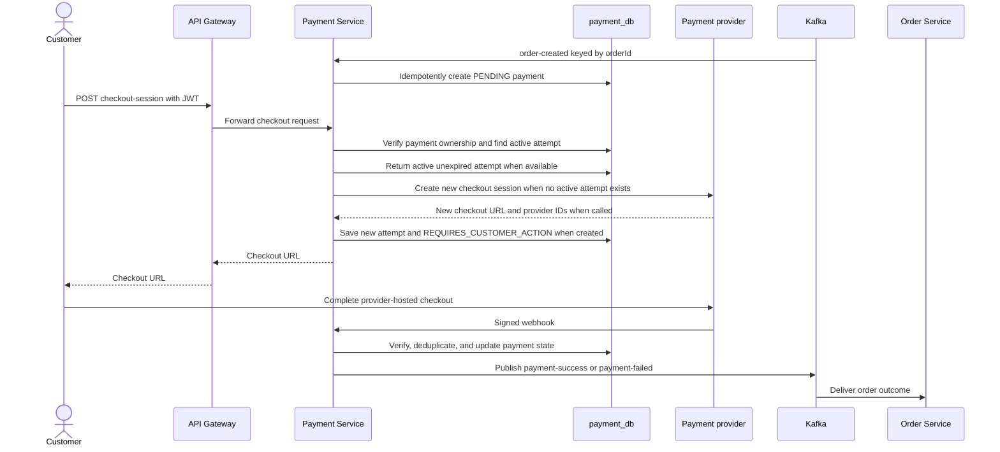
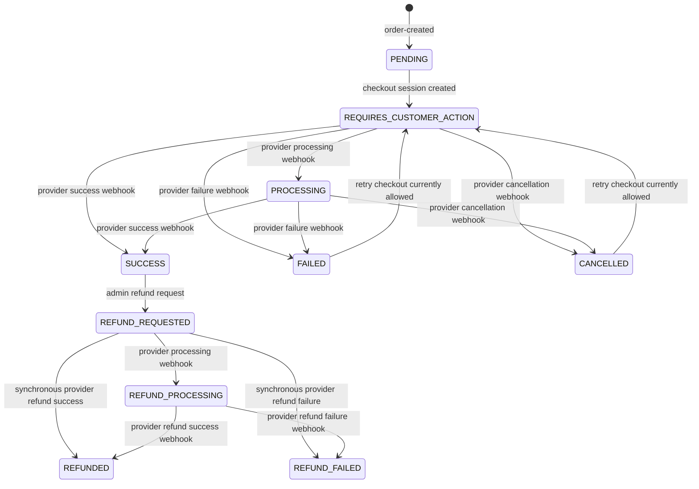
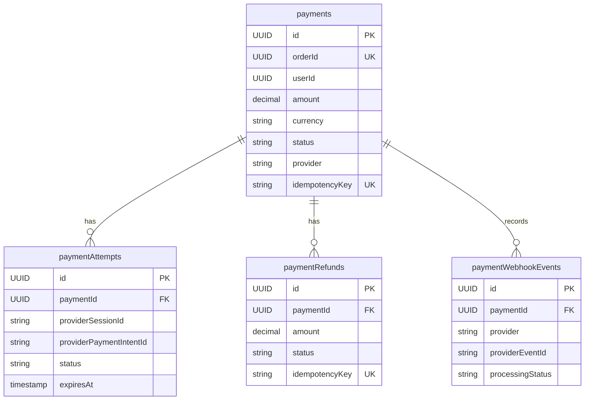

# Payment Service

## What it does

Payment Service owns one payment per order, checkout-session creation, provider
webhook verification, payment attempts, refunds, and publication of payment
outcome events. It consumes `order-created` from Kafka rather than receiving a
synchronous Order Service call in the active flow.

| Concern | Current behavior |
| --- | --- |
| Local ports | 8087 REST and 9092 gRPC |
| Store | PostgreSQL `payment_db` |
| Tables | `payments`, `payment_attempts`, `payment_refunds`, `payment_webhook_events` |
| Kafka input | `order-created`, consumer group `payment-service` |
| Kafka outputs | `payment-success`, `payment-failed`, both keyed by `orderId` |
| Customer API | Checkout and own-payment queries with JWT ownership checks |
| Admin API | Payment queries and refund request |
| Provider interface | Checkout API and signed inbound webhook |
| Observability | Actuator, Prometheus, provider metrics, tracing, structured JSON logs |

## Checkout and webhook user flow

The provider webhook, not a customer return page, is the authoritative source
of the payment result.

## REST API

| Method | Endpoint | Access | Behavior |
| --- | --- | --- | --- |
| POST | `/api/v1/payments/orders/{orderId}/checkout-session` | Bearer JWT owner | Create/reuse a checkout session for an order's payment. |
| GET | `/api/v1/payments/me` | Bearer JWT | Paginated current-user payments. |
| GET | `/api/v1/payments/orders/{orderId}` | Bearer JWT owner | Get payment for an owned order. |
| GET | `/api/v1/payments/{paymentId}` | Bearer JWT owner | Get one owned payment. |
| GET | `/api/v1/admin/payments` | `ADMIN` | Paginated payment list. |
| GET | `/api/v1/admin/payments/{paymentId}` | `ADMIN` | Admin payment detail. |
| POST | `/api/v1/admin/payments/{paymentId}/refund` | `ADMIN` | Request a provider refund. |
| GET | `/public/payments/success` | Public | Provider/customer return page. |
| GET | `/public/payments/cancel` | Public | Provider/customer return page. |
| POST | `/api/v1/payments/webhooks/stripe` | Provider signature | Stripe webhook processing. |
| POST | `/api/v1/payments/webhooks/razorpay` | Provider signature | Razorpay webhook endpoint; adapter is not implemented. |

## gRPC API

| RPC | Current use | Purpose |
| --- | --- | --- |
| `ProcessPayment` | No active caller in this repository's Order flow | Find/create a payment and return a checkout session. |
| `RefundPayment` | No active caller in this repository's Order flow | Request an idempotent refund. |
| `GetPaymentStatus` | No active caller in this repository's Order flow | Read payment status by order ID. |

The gRPC contract is defined in `common/common-proto/src/main/proto/payment.proto`.

## Payment lifecycle

Terminal payment success produces `payment-success`. Provider `FAILED` and
`CANCELLED` payment states produce `payment-failed`. Refund status does not
currently change Order Service state or publish an inventory/order event.

## Data ownership

`payments.orderId` is a logical reference to the Order Service database, not a
cross-service database foreign key.

## Idempotency and provider handling

| Area | Current rule |
| --- | --- |
| Order-created consumer | Uses unique payment `order_id` and `order-created:{orderId}` idempotency key. |
| Checkout request | Reuses an active, unexpired attempt where possible. |
| Webhook | Unique `(provider, provider_event_id)` prevents duplicate processing and duplicate outcome emission. |
| Refund | Idempotency is enforced by payment/refund idempotency data; total non-failed requested, processing, and completed refunds cannot exceed payment amount. |
| Kafka outcome | Success/failure events are keyed by `orderId` and carry event, correlation, and trace identifiers. |

| Provider | Checkout | Webhook | Refund | Current note |
| --- | --- | --- | --- | --- |
| Stripe | Implemented | Signature verified and parsed | Implemented | Use test credentials in dev/stage. |
| Sandbox | Deterministic mock URL | Adapter can parse signed events | Returns processing response | No public Sandbox webhook endpoint exists. |
| Razorpay | Not implemented | Not implemented | Not implemented | Adapter-ready only; current calls return errors. |

## Current limitations

- Payment outcomes use direct asynchronous Kafka sends from webhook processing;
  database commit and Kafka delivery are not atomic. PAYMENT-104 is the
  transactional-outbox follow-up.
- The `order-created` consumer has no explicit Payment Service retry/DLQ
  configuration in this repository.
- The controller exposes Stripe and Razorpay webhook paths, not Sandbox. A
  local Sandbox checkout cannot complete the normal inbound webhook path.
- Gateway routes `/api/v1/payments/**` but not `/public/payments/**`; provider
  return URLs need direct service access or a gateway route.
- A webhook that cannot be matched to an attempt/refund is acknowledged with a
  failed processing response and has no later reconciliation queue.
- Payment Service permits checkout after `FAILED` or `CANCELLED`, while Order
  Service may already have released stock and made the order `PAYMENT_FAILED`.
  A later success is ignored by Order Service until a retry/reorder policy is
  designed.
- Admin refund behavior is not coordinated with Order/Inventory state.

## Monitoring

Payment Service records payment created, checkout, success/failure/cancellation,
refund, webhook received/duplicate/invalid-signature, and provider-latency
metrics. Generic service health, HTTP error-rate, and latency alerts cover it;
the repository does not currently provision a dedicated Payment dashboard or
payment-specific alert.

## Main implementation locations

| Concern | Location |
| --- | --- |
| Customer/admin/public/webhook REST APIs | `payment-service/src/main/java/com/ecommerce/payment/controller/` |
| Payment preparation | `payment-service/src/main/java/com/ecommerce/payment/service/impl/PaymentServiceImpl.java` |
| Checkout | `payment-service/src/main/java/com/ecommerce/payment/service/impl/PaymentCheckoutServiceImpl.java` |
| Webhooks | `payment-service/src/main/java/com/ecommerce/payment/service/impl/PaymentWebhookServiceImpl.java` |
| Refunds | `payment-service/src/main/java/com/ecommerce/payment/service/` |
| Kafka consumer/producer | `payment-service/src/main/java/com/ecommerce/payment/kafka/` |
| gRPC server | `payment-service/src/main/java/com/ecommerce/payment/grpc/PaymentGrpcService.java` |
| Provider adapters | `payment-service/src/main/java/com/ecommerce/payment/provider/` |
| Schema | `payment-service/src/main/resources/db/migration/` |
