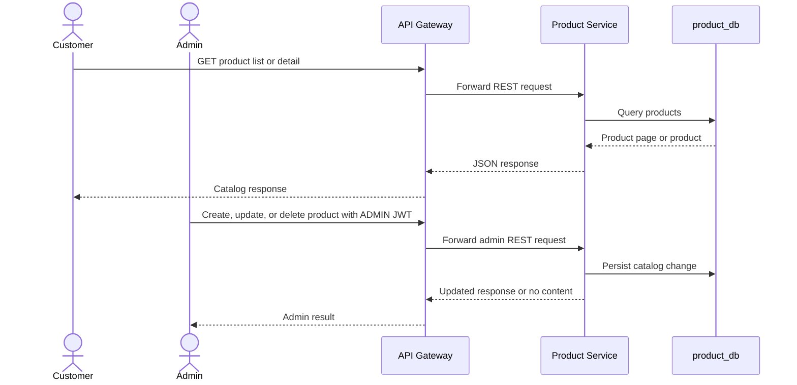
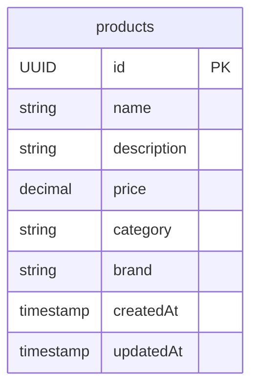

# Product Service

## What it does

Product Service owns the product catalog. Customers can browse a paginated
catalog and product details; administrators can create, bulk-create, update,
and hard-delete products. It is a standalone REST service: it currently has no
Kafka, gRPC, cache, Inventory, or Order integration.

| Concern | Current behavior |
| --- | --- |
| Local port | 8082 |
| Store | PostgreSQL `product_db` |
| Main table | `products` |
| API style | REST JSON and OpenAPI |
| Security | Public catalog reads; `ADMIN` for mutations |
| Async messaging | None |
| gRPC | None |
| Observability | Actuator, Prometheus, tracing, structured JSON logs |

## Customer and administrator flow

## REST API

| Method | Endpoint | Access | Behavior |
| --- | --- | --- | --- |
| GET | `/api/v1/products` | Public | Paginated product list; accepts `page`, `size`, `category`, `minPrice`, and `maxPrice`. |
| GET | `/api/v1/products/{productId}` | Public | Get one product. |
| POST | `/api/v1/admin/products` | `ADMIN` | Create one product; returns `201 Created`. |
| POST | `/api/v1/admin/products/bulk` | `ADMIN` | Create many products; returns `201 Created`. |
| PUT | `/api/v1/admin/products/{productId}` | `ADMIN` | Update product fields. |
| DELETE | `/api/v1/admin/products/{productId}` | `ADMIN` | Hard-delete product; returns `204 No Content`. |

## Data ownership

The service owns catalog identity and basic display/price fields. It does not
own stock, product images, customer carts, orders, or payment data.

## Request behavior and security

| Area | Rule |
| --- | --- |
| Catalog search | Category filtering is optional. Price range filtering is applied only when both `minPrice` and `maxPrice` are provided. |
| Pagination | The controller exposes page/size parameters; no sorting parameter is exposed. |
| Authorization | `/api/v1/admin/**` requires `ROLE_ADMIN`; catalog reads are public. |
| Identity | JWT `role` is converted to Spring roles by the shared security module. |
| Diagnostics | Health, info, Prometheus, and OpenAPI are permitted by service security. |

## Current limitations

- Creating a product does not create Inventory Service stock automatically.
- There is no Product-to-Inventory foreign key or service call; inventory may
  exist for a UUID that is not a product.
- Order Service accepts client-supplied item prices and does not currently
  request Product Service for authoritative price validation.
- No product lifecycle event, cache, soft deletion, images, currency field,
  optimistic version, stock view, or price history is implemented.
- Supplying only `minPrice` or only `maxPrice` ignores that price bound. A
  supplied category filter still applies.

## Main implementation locations

| Concern | Location |
| --- | --- |
| REST controller | `product-service/src/main/java/com/ecommerce/product/controller/ProductController.java` |
| Domain service | `product-service/src/main/java/com/ecommerce/product/service/ProductService.java` |
| Entity and repository | `product-service/src/main/java/com/ecommerce/product/entity/Product.java`, `repository/ProductRepository.java` |
| Security | `product-service/src/main/java/com/ecommerce/product/config/SecurityConfig.java` |
| Schema | `product-service/src/main/resources/db/migration/V1__create_products_table.sql` |
